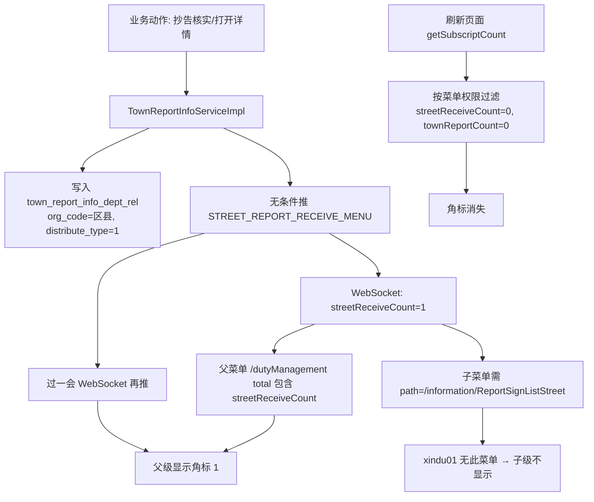

# Badge push design analysis
_Exported on 2026/7/9 at GMT+8 0:06:40 from Cursor (3.10.17)_

---

**User**

梳理分析下现在的角标推送设计，是不是目前设计就存在问题？参考下我与codex的两个会话
@e:\mayu_work\summary\.vscode\项目\shuchuang0609\线上环境\排查流程_查找菜单名称和角色.md @e:\mayu_work\summary\.vscode\项目\shuchuang0609\线上环境\排查流程_排查值班值守角标异常.md 

---

**Cursor**

先读你提供的两份排查记录，并在代码库里定位角标推送相关实现。


继续读核心实现，核对父子角标、WebSocket 推送与初始化接口是否一致。


结合你提供的两份 Codex 排查记录和当前代码，可以明确说：**角标推送设计确实存在结构性问题**，不只是配置或偶发数据问题。xindu01 的线上现象，是这套设计缺陷的典型表现。

---

## 一、设计意图 vs 实际实现

系统本来想做**三层分级角标**：

| 业务层级 | MenuEum 枚举 | Vuex 字段 | 子菜单路径 | 主要数据表 |
|---------|-------------|----------|-----------|-----------|
| 市级值班室 | `REPORT_RECEIVE_MENU` | `inforConfirm` | `/information/reportSignList` | `report_info_dept_rel`（主库） |
| 区县值班室 | `COUNTY_REPORT_RECEIVE_MENU` | `townReportCount` | `/information/ReportReceiveListStreet` | `town_report_dept`（town 库） |
| 镇街 | `STREET_REPORT_RECEIVE_MENU` | `streetReceiveCount` | `/information/ReportSignListStreet` | `town_report_info_dept_rel`（town 库） |

这个分层思路本身合理，但**实现上三层边界被打穿了**，导致推送目标、统计口径、前端展示三者经常对不上。

---

## 二、完整链路（以 xindu01 为例）



你抓到的实时证据已经闭环：

- WebSocket：`{"menuType":"STREET_REPORT_RECEIVE_MENU","count":1}`
- SQL：`0 0 1`（老市级表=0，区县 `town_report_dept`=0，`town_report_info_dept_rel`=1）
- 明细：`org_code=A01A03A02A09`，`distribute_type=1`，`create_by=xindu01`（区县自己发起的核实关系）

**结论：区县自己的 org_code 被当成“街镇签收”推送了。**

---

## 三、核心设计问题（按严重程度）

### 问题 1：后端推送不区分区县/街镇（根因）

`TownReportInfoServiceImpl` 里多处**无条件推 `STREET_REPORT_RECEIVE_MENU`**，没有判断 `orgCode` 是区县总值班室还是镇街：

**抄告核实**（你的数据 `distribute_type=1` 最可能走这里）：

```470:481:dyh-lbzbzllzxt-api/jeecg-boot-module-operation/src/main/java/org/jeecg/operation/service/impl/TownReportInfoServiceImpl.java
        verifyOrgCodes.forEach(orgCode -> {
            ...
            for (String userId : userIds) {
                int count = reportInfoDeptRelService.count(... orgCode ... status = "0" ... distributeType in (1,2));
                sendMsgUtil.sendMsgOnlyMark(new MenuMarkNotifyEvent(userId, MenuMarkNotifyEvent.MenuEum.STREET_REPORT_RECEIVE_MENU, count));
            }
```

**领导批示/传达**（`distribute_type=2`，同样问题）：

```1503:1506:dyh-lbzbzllzxt-api/jeecg-boot-module-operation/src/main/java/org/jeecg/operation/service/impl/TownReportInfoServiceImpl.java
            for (String userId : userIds) {
                int count = reportInfoDeptRelService.count(...);
                sendMsgUtil.sendMsgOnlyMark(new MenuMarkNotifyEvent(userId, MenuMarkNotifyEvent.MenuEum.STREET_REPORT_RECEIVE_MENU, count));
            }
```

**公共刷新方法**（打开详情等操作也会触发，解释“隔一会又出现”）：

```1630:1641:dyh-lbzbzllzxt-api/jeecg-boot-module-operation/src/main/java/org/jeecg/operation/service/impl/TownReportInfoServiceImpl.java
    private void notifyStreetReceiveMenuCount(String orgCode) {
        ...
        for (String userId : userIds) {
            sendMsgUtil.sendMsgOnlyMark(new MenuMarkNotifyEvent(userId, MenuMarkNotifyEvent.MenuEum.STREET_REPORT_RECEIVE_MENU, count));
        }
    }
```

对比之下，**创建信息**走的是正确分支：

```200:202:dyh-lbzbzllzxt-api/jeecg-boot-module-operation/src/main/java/org/jeecg/operation/service/impl/TownReportInfoServiceImpl.java
                sendMsgUtil.sendMsgOnlyMark(new MenuMarkNotifyEvent(userId, MenuMarkNotifyEvent.MenuEum.COUNTY_REPORT_RECEIVE_MENU, reportDeptCount));
```

说明：**同一条业务线里，创建和核实/批示用了不同的 menuType 策略**，设计不一致。

---

### 问题 2：刷新接口与 WebSocket 统计口径不一致

`getSubscriptCount()` 里区县和街镇用的是**不同表、不同条件**：

```1886:1906:dyh-lbzbzllzxt-api/jeecg-boot-module-operation/src/main/java/org/jeecg/operation/service/impl/EventInfoServiceImpl.java
        // 区县接报 → town_report_dept (is_city=0, is_read=0, status not in 11/15)
        int townReportCount = permissions.contains("/information/ReportReceiveListStreet") ? reportDeptCount : 0;

        // 街道签收 → town_report_info_dept_rel (status=0, distribute_type in 1,2)
        int streetReceiveCount = permissions.contains("/information/ReportSignListStreet") ? count : 0;
```

WebSocket 延时重算（`SocketTimeOutUtil`）：

- `COUNTY_REPORT_RECEIVE_MENU` → 查 `town_report_info_dept_rel`（status=0）
- `STREET_REPORT_RECEIVE_MENU` → 也查 `town_report_info_dept_rel`（不限 status）

而直接推送（`sendNotifyOneByOne`）则**直接用传入的 count，不再重算，也不校验菜单权限**。

这就解释了 xindu01 的 `0 0 1` 现象：

| 口径 | 数据源 | 结果 |
|-----|-------|-----|
| 刷新 `townReportCount` | `town_report_dept` | 0 |
| 刷新 `streetReceiveCount` | 有权限才计，xindu01 无街镇菜单 | 0 |
| WebSocket `STREET_REPORT_RECEIVE_MENU` | `town_report_info_dept_rel` | 1 |

**刷新清零、WebSocket 再点亮**，不是偶发，是两套口径必然冲突。

---

### 问题 3：前端父菜单角标不是“子菜单聚合”

子菜单角标：按 `menu.path` 精确匹配，一对一显示。

父菜单 `/dutyManagement` 却是**全局字段硬加**：

```564:576:dyh-lbzbzllzxt-front/src/components/menu/index.js
      total =
        this.eventManageNum +
        this.leaderInstructionNum +
        this.information +
        this.inforConfirm +
        ...
        this.townReportCount+
        this.streetReceiveCount;
```

区县用户只减了 `townReportCount`，**没减 `streetReceiveCount` 和 `inforConfirm`**：

```590:593:dyh-lbzbzllzxt-front/src/components/menu/index.js
      if(orgType ==4){
        total = total - this.townReportCount;
        total3 = total3 - this.townFileExchangeCount;
      }
```

所以会出现：

- 父级“值班值守”有 1
- 展开后子菜单全没角标
- 背景音乐一直响（`streetReceiveCount` 进了 music1 统计）

**“父级有数，子级必有数”这个用户预期，在当前实现里根本不成立。**

---

### 问题 4：WebSocket 推送不做菜单权限过滤

初始化接口会按 `permissions.contains(menuPath)` 过滤：

```1846:1846:dyh-lbzbzllzxt-api/jeecg-boot-module-operation/src/main/java/org/jeecg/operation/service/impl/EventInfoServiceImpl.java
        int receiveCount = permissions.contains("/information/reportSignList") ? reportedCity : 0;
```

WebSocket 侧 `MenuNotifyListener` 对 `STREET_REPORT_RECEIVE_MENU` / `COUNTY_REPORT_RECEIVE_MENU` 的**单人直推**路径，直接把 `event.getNum()` 发出，**不检查用户是否有对应菜单权限**。

这导致：用户收到了自己菜单树里根本不存在的角标类型。

---

### 问题 5：路径硬编码 + 菜单配置混乱（加剧问题）

前端所有角标绑定都是 `menu.path === '/xxx'` 硬编码，和后端 `sys_permission` 动态菜单是两套体系。

已知配置问题：

- `试点区县角色` 同时授权了 `/information/ReportReceiveListStreet` 和 `/information/reportSignList`（老市级签收）
- `/information/ReportReceiveListStreet` 在库里有两条同名记录（挂不同父菜单）
- `/duty/Emergency` 代码路径与库中 `/information/receive1` 不一致

这些不是 xindu01 这次的主因（这次推的是 `STREET_REPORT_RECEIVE_MENU`），但会制造更多“父亮子不亮”的场景。

---

### 问题 6：前端局部 bug（次要但真实）

`EmergencyList.vue` 监听了不存在的 `emergencyCheckCount`，清理时用了 `SET_CHECK_COUNT` 而非 `SET_EMERGENCY_RECORD`，会导致应急响应角标/音乐状态异常，但与本次 xindu01 主问题无关。

---

## 四、xindu01 案例的最终定性

| 维度 | 判断 |
|-----|------|
| 是不是代码问题？ | **是，主要是代码链路问题** |
| 有没有配置问题？ | **有，`试点区县角色` 混入了老菜单，但不是这次主因** |
| 应该推什么？ | **`COUNTY_REPORT_RECEIVE_MENU`**（区县接报），不是 `STREET_REPORT_RECEIVE_MENU` |
| 为什么列表无红行？ | 角标来自 `town_report_info_dept_rel` 核实关系，区县接报列表看的是 `town_report_dept`，数据源不同 |
| 为什么刷新消失？ | `getSubscriptCount` 全 0（权限过滤 + 不同表统计） |
| 为什么过会又出现？ | `notifyStreetReceiveMenuCount` 或其他操作再次 WebSocket 推送 |

---

## 五、修复方向建议（仅分析，不改代码）

### 后端（优先）

1. **统一推送决策函数**：根据 `orgCode` 的 `orgType`/部门类型 + 用户菜单权限，决定推 `REPORT_RECEIVE_MENU` / `COUNTY_REPORT_RECEIVE_MENU` / `STREET_REPORT_RECEIVE_MENU`。
2. **修正核实/批示/刷新方法**：`addVerify`、`notifyStreetReceiveMenuCount`、领导批示分支，区县 orgCode 应推 `COUNTY_REPORT_RECEIVE_MENU`（或根本不生成街镇签收关系）。
3. **统一 count 口径**：`getSubscriptCount` 与 WebSocket 重算必须用同一套 SQL/条件；明确 `town_report_dept` 与 `town_report_info_dept_rel` 各自负责什么业务状态。
4. **WebSocket 推送前校验**：目标用户是否拥有对应菜单 URL，没有则不推。

### 前端

1. **父菜单角标改为递归聚合可见子菜单**，不要全局硬加。
2. 区县用户父级汇总时，排除不属于本角色菜单树的字段（`streetReceiveCount`、`inforConfirm` 等）。
3. 修复 `EmergencyList.vue` 字段名不一致。

### 配置（辅助）

1. `试点区县角色` 去掉 `/information/reportSignList`。
2. 清理重复菜单记录，统一 `/duty/Emergency` 路径。

---

## 六、一句话总结

当前角标推送设计的**分层概念是对的，但实现是“三套表 + 三种 menuType + 前端硬编码路径 + 父级全局求和”拼凑出来的**，缺少统一的“按组织层级 + 菜单权限 + 统计口径”决策层。

xindu01 的现象（父级有角标、子级没有、刷新消失、WebSocket 再出现）不是 UI bug，而是这套设计允许且必然会发生的结构性问题。你抓到的 `STREET_REPORT_RECEIVE_MENU` + SQL `0 0 1`，已经把根因钉死在 `TownReportInfoServiceImpl` 核实/刷新链路上了。

如果需要，我可以下一步按文件列出一份更细的“改动清单”（哪些方法、应改成什么判断逻辑），方便你或团队开修复任务。

---

**User**

是否有办法在我本地环境复现这个问题？我需要怎么做才能复现

---

**Cursor**

先查本地环境配置和能触发该 WebSocket 推送的入口，再给你一套可操作的复现步骤。


可以，本地完全可以复现，而且你们这个 case 不需要连线上环境。按**从易到难**给你三条路径。

---

## 复现前准备

### 1. 环境

本地配置（`application.yml`）需要：

| 组件 | 地址 |
|-----|------|
| 主库 `zbzs` | `localhost:3306` |
| town 库 `liangban` | `localhost:3306`（`town_report_*` 表在这里） |
| Redis | `127.0.0.1:6379` |
| 后端 | `127.0.0.1:8080` |
| 前端 | `127.0.0.1:8081`（代理已开 `ws: true`） |

### 2. 测试账号（关键）

需要一个**区县总值班室用户**，条件尽量贴近 xindu01：

```sql
-- 在 zbzs 库查可用区县账号
SELECT
  u.id, u.username, u.realname, u.org_code,
  d.depart_name, d.org_type,
  r.role_name, r.role_code
FROM sys_user u
JOIN sys_user_depart sud ON sud.user_id = u.id
JOIN sys_depart d ON d.id = sud.dep_id
JOIN sys_user_role ur ON ur.user_id = u.id
JOIN sys_role r ON r.id = ur.role_id
WHERE r.role_code IN ('0730', 'test09')   -- 试点区县 / 区总值班室
   OR d.org_type = '4';
```

再确认菜单权限（复现“父亮子不亮”时，**最好没有街镇签收菜单**）：

```sql
SELECT p.name, p.url
FROM sys_user u
JOIN sys_user_role ur ON ur.user_id = u.id
JOIN sys_role_permission rp ON rp.role_id = ur.role_id
JOIN sys_permission p ON p.id = rp.permission_id
WHERE u.username = '你的区县账号'
  AND p.url IN (
    '/information/ReportReceiveListStreet',
    '/information/reportSignList',
    '/information/ReportSignListStreet'
  );
```

理想状态：

- 有 `/information/ReportReceiveListStreet`（区县接报）
- **没有** `/information/ReportSignListStreet`（街镇签收）

本地若 `test09` 角色只有接报、没有街镇签收，就可以直接用来复现。

### 3. 浏览器观察点

打开 F12，重点看：

1. **Network → WS**：是否有 `{"menuType":"STREET_REPORT_RECEIVE_MENU","count":1}`
2. **Console**：`初始化soket角标`、`父角标==>`
3. **XHR**：`/report/eventInfo/getSubscriptCount` 返回值是否全 0

---

## 方法一：SQL 造数 + 打开详情（最快，推荐）

这条路径最稳，直接模拟线上那条 `town_report_info_dept_rel` 数据。

### Step 1：确认区县用户 org_code

```sql
-- zbzs 库
SET @username = '你的区县账号';  -- 如本地 test09 对应用户
SET @org_code = (
  SELECT u.org_code FROM sys_user u WHERE u.username = @username LIMIT 1
);
SELECT @org_code;
```

### Step 2：在 liangban 库准备一条信息

```sql
-- liangban 库
SET @org_code = '上一步查到的 org_code';
SET @user_id = '区县用户 id';

-- 看是否已有可用信息
SELECT id, create_org_code, status
FROM town_report_info
WHERE create_org_code = @org_code
ORDER BY create_time DESC
LIMIT 5;
```

若没有，插入一条最小信息：

```sql
INSERT INTO town_report_info (
  id, information_describe, status, is_read, create_org_code,
  create_by, create_time, update_by, update_time, is_deleted
) VALUES (
  REPLACE(UUID(), '-', ''),  -- 或用雪花 id
  '本地复现测试信息', '10', 0, @org_code,
  @user_id, NOW(), @user_id, NOW(), 0
);
SET @report_info_id = LAST_INSERT_ID();  -- 若用手动 id 则直接 SET
```

### Step 3：插入“待处理核实关系”（核心）

```sql
-- liangban 库，模拟线上那条数据
INSERT INTO town_report_info_dept_rel (
  id, report_info_id, org_code, status, distribute_type,
  is_verify, is_deleted, create_by, create_time, update_by, update_time
) VALUES (
  REPLACE(UUID(), '-', ''),
  @report_info_id,
  @org_code,        -- 区县自己的 org_code
  '0',              -- 待处理
  1,                -- 抄告核实
  2, 0,
  @user_id, NOW(), @user_id, NOW()
);
```

### Step 4：登录并触发 WebSocket

用区县账号登录前端，然后**打开该条信息详情**。

触发点在代码里：

```429:429:dyh-lbzbzllzxt-api/jeecg-boot-module-operation/src/main/java/org/jeecg/operation/service/impl/TownReportInfoServiceImpl.java
        notifyStreetReceiveMenuCount(loginUser.getOrgCode());
```

UI 路径：进入 **接报信息**（`ReportReceiveListStreet`）→ 点某条记录进详情。

或直接调接口（需带登录 token）：

```http
GET /dyh/lbzb/town_report_info/information_details?id={report_info_id}
```

### Step 5：验证是否复现成功

应看到与线上一致的现象：

| 现象 | 预期 |
|-----|------|
| 父菜单「值班值守」 | 角标 = 1 |
| 展开子菜单 | **没有任何子菜单角标** |
| `getSubscriptCount` | `townReportCount=0`, `streetReceiveCount=0` |
| WebSocket | `STREET_REPORT_RECEIVE_MENU`, `count=1` |
| 刷新页面 | 角标消失 |
| 再次打开详情 | 角标又出现 |
| 背景音乐 | 可能持续响（`streetReceiveCount` 进了 music1 统计） |

同时跑三条 count SQL 验证 `0 0 1`：

```sql
-- zbzs：老市级链路
SELECT COUNT(1) FROM report_info_dept_rel a
WHERE a.is_deleted=0 AND a.org_code=@org_code
  AND a.distribute_type IN (1,2,3) AND a.is_verify=1;

-- liangban：区县刷新口径
SELECT COUNT(1) FROM town_report_dept a
WHERE a.is_deleted=0 AND a.is_read=0 AND a.is_city=0
  AND a.status NOT IN ('11','15') AND a.org_code=@org_code;

-- liangban：WebSocket 实际用的口径
SELECT COUNT(1) FROM town_report_info_dept_rel a
WHERE a.is_deleted=0 AND a.org_code=@org_code
  AND a.status='0' AND a.distribute_type IN (1,2);
```

---

## 方法二：完整 UI 流程——抄告核实（更贴近业务）

适合验证 `addVerify` 链路。

### 操作步骤

1. 区县账号登录
2. 进入 **接报信息**（`/information/ReportReceiveListStreet`）
3. 选一条已有信息，点 **抄告核实**
4. 在核查部门树里选一个单位（**不要选自己**，后端会 `remove(loginUser.getOrgCode())`）
5. 填内容后提交

前端实际调用：

```189:189:dyh-lbzbzllzxt-front/src/components/detail/verifyDistrict.vue
          postAction('/town_report_info/addVerify', obj).then((res) => {
```

后端会无条件推：

```479:480:dyh-lbzbzllzxt-api/jeecg-boot-module-operation/src/main/java/org/jeecg/operation/service/impl/TownReportInfoServiceImpl.java
                sendMsgUtil.sendMsgOnlyMark(new MenuMarkNotifyEvent(userId, MenuMarkNotifyEvent.MenuEum.STREET_REPORT_RECEIVE_MENU, count));
```

### 注意

- 若核查部门选的是**镇街 org_code**，推送对象是镇街用户，区县账号可能**收不到** WebSocket。
- 要复现 xindu01「区县用户自己收到 `STREET_REPORT_RECEIVE_MENU`」，更可靠的是：
  - 方法一（SQL + 打开详情），或
  - 核查部门选到**仍归属区县总值班室 org_code 下的单位**（与 xindu01 那条 `org_code=A01A03A02A09` 一致）

---

## 方法三：创建信息时带抄告单位（异步触发）

创建信息时若填了抄告单位，2 秒后会异步调 `addVerify`：

```176:186:dyh-lbzbzllzxt-api/jeecg-boot-module-operation/src/main/java/org/jeecg/operation/service/impl/TownReportInfoServiceImpl.java
        if (CollUtil.isNotEmpty(dto.getCopyingUnits())) {
            Thread thread = new Thread(() -> {
                try {
                    Thread.sleep(2000);
                    ...
                    addVerify(townReportInfoVerifyDto);
```

步骤：

1. 区县账号登录
2. 在接报信息页 **新建信息**，填写抄告单位（选其他部门，非自己）
3. 等约 2 秒，观察 WebSocket 和角标

这条路径也能打出错误 `menuType`，但时机不如方法一可控。

---

## 复现成功的判定标准

满足下面 **4 条** 就算复现成功：

1. WebSocket 收到 `STREET_REPORT_RECEIVE_MENU`（不是 `COUNTY_REPORT_RECEIVE_MENU`）
2. 父级「值班值守」角标 = 1，展开后子菜单无角标
3. `getSubscriptCount` 刷新后全 0（或 `streetReceiveCount=0`）
4. count SQL 为 `0 0 1`（老表 / 区县 town_report_dept / town_report_info_dept_rel）

---

## 常见问题

**Q：插了数据但 WebSocket 没推？**  
- 确认后端在跑、Redis 正常、前端代理 `ws: true`  
- 必须触发 `notifyStreetReceiveMenuCount`：打开信息详情，不是只停在列表页  
- 确认当前登录用户 `org_code` 与 `town_report_info_dept_rel.org_code` 一致

**Q：`town_report_dept` 表不存在？**  
- 查错库了，应在 `liangban`，不是 `zbzs`

**Q：父级没角标？**  
- 看用户 `orgType` 是否为 `4`（区县）  
- 父级汇总包含 `streetReceiveCount`，区县用户不会减掉这个字段，理论上应有角标

**Q：子菜单也有角标？**  
- 说明该账号有 `/information/ReportSignListStreet` 权限，现象会被掩盖  
- 换一个没有街镇签收菜单的区县账号，或临时去掉该权限再测

**Q：想 100% 对齐 xindu01？**  
- 用方法一，把 `org_code`、`distribute_type=1`、`status=0`、`create_by=区县用户` 按线上那条 INSERT 原样写入 `liangban.town_report_info_dept_rel`，再打开详情即可。

---

## 建议操作顺序

1. 先用**方法一**确认能稳定复现（约 10 分钟）  
2. 再用**方法二**走一遍抄告核实，验证业务入口也会触发  
3. 修复后，用同一套步骤回归：应推 `COUNTY_REPORT_RECEIVE_MENU`，且父/子角标一致

如果你告诉我本地区县测试账号的 `username` 和 `org_code`，我可以按你的库结构写一版可直接粘贴执行的完整 SQL 脚本。

---

**User**

// 市政府值班室信息接报中抄告核实给 区县值班室(龙泉驿区总值班室)，龙泉驿区总值班室websocket会收到以下消息：
{"count":1,"menuType":"REPORT_RECEIVE_MENU"}
{"barType":"REPORT_RECEIVE_BAR","id":"2074833901348069378"}
// 这个链路是正常的，值班值守菜单角标数与信息签收菜单角标数一致。

// 龙泉驿区总值班室在信息签收详情中抄告给街道，街道在签收信息进行续报，龙泉驿区总值班室websocket会收到以下消息：
{"count":1,"menuType":"REPORT_RECEIVE_MENU"}
{"barType":"REPORT_RECEIVE_BAR","id":"2074833901348069378"}
// 这个链路也是正常的，值班值守菜单角标数与信息签收菜单角标数一致。


为啥复现不了呢？界面上要怎么操作才行呢

---

**Cursor**

你描述的两条链路走的是市级老签收体系，和 xindu01 那条 bug 不是同一路。我先在代码里把各操作的 menuType 推送入口对齐清楚。


你复现不了，是因为你测的两条链路**本来就是“老市级签收体系”的正常路径**，和 xindu01 线上那条异常**不是同一个入口、不是同一个 menuType**。

你看到的是 `REPORT_RECEIVE_MENU`，龙泉驿区总值班室又有 **信息签收** 菜单，所以父级「值班值守」和子级「信息签收」角标能对上——这恰恰说明这两条链路**没有触发我们要找的 bug**。

---

## 一、为什么你测的两条链路“正常”

系统里其实有**两套并行的抄告/签收体系**：

| 体系 | 数据表 | menuType | 前端子菜单 | 典型入口 |
|-----|--------|----------|-----------|---------|
| **老市级链路** | `report_info_dept_rel`（zbzs 主库） | `REPORT_RECEIVE_MENU` | **信息签收** `/information/reportSignList` | 市政府「信息接报」、区县「信息签收」 |
| **新镇街/区县链路** | `town_report_info_dept_rel`（liangban 库） | `STREET_REPORT_RECEIVE_MENU` | **签收信息** `/information/ReportSignListStreet` | 区县「接报信息」 |
| **新区县接报链路** | `town_report_dept`（liangban 库） | `COUNTY_REPORT_RECEIVE_MENU` | **接报信息** `/information/ReportReceiveListStreet` | 镇街上报到区县 |

### 你测的链路 1：市政府 → 龙泉驿

```
市政府「信息接报」抄告核实
  → API: /report/reportInfo/addVerify
  → 写 report_info_dept_rel
  → 推 REPORT_RECEIVE_MENU
  → 龙泉驿「信息签收」显示角标 ✓
```

### 你测的链路 2：龙泉驿「信息签收」→ 街道续报

```
龙泉驿「信息签收」抄告街道
  → API: /town_report_info/cityAddVerify（不是 addVerify！）
  → 街道侧走 town 库

街道「签收信息」续报
  → TownReportInfoServiceImpl.saveInformationRenewal
  → 因为有 cityReportId/cityReportCode，续报通知回区县
  → 推 REPORT_RECEIVE_MENU（给 cityReportCode 对应区县用户）
  → 龙泉驿「信息签收」显示角标 ✓
```

这两条都落在 `REPORT_RECEIVE_MENU` → `inforConfirm` → `/information/reportSignList`，龙泉驿又有这个菜单，所以**看起来完全正常**。

---

## 二、xindu01 异常链路是什么

线上抓包是：

```json
{"menuType":"STREET_REPORT_RECEIVE_MENU","count":1}
```

不是 `REPORT_RECEIVE_MENU`。

对应操作应是 **新区县「接报信息」体系**，不是「信息签收」：

```
区县「接报信息」(本级调度下) 抄告核实 / 打开详情
  → API: /town_report_info/addVerify 或 information_details
  → 写 town_report_info_dept_rel
  → 推 STREET_REPORT_RECEIVE_MENU（代码 bug：应推 COUNTY）
  → streetReceiveCount=1 点亮父级「值班值守」
  → 但区县没有「签收信息」子菜单 → 展开后子级无角标
  → 刷新 getSubscriptCount 全 0 → 角标消失
  → 再打开详情 → WebSocket 又推 → 角标又出现
```

**关键差异：入口是「接报信息」，不是「信息签收」。**

---

## 三、界面上要怎么操作才能复现

### 前置确认（很重要）

用龙泉驿区县账号查菜单：

```sql
SELECT p.name, p.url
FROM sys_user u
JOIN sys_user_role ur ON ur.user_id = u.id
JOIN sys_role_permission rp ON rp.role_id = ur.role_id
JOIN sys_permission p ON p.id = rp.permission_id
WHERE u.username = '龙泉驿区县账号'
  AND p.url IN (
    '/information/reportSignList',           -- 信息签收（老）
    '/information/ReportReceiveListStreet',  -- 接报信息（新·区县）
    '/information/ReportSignListStreet'      -- 签收信息（新·街镇）
  );
```

- 有 `reportSignList` → 测 `REPORT_RECEIVE_MENU` 永远“正常”，复现不了父亮子不亮
- 要复现 bug，需要走 **`ReportReceiveListStreet`（接报信息）**，并观察是否收到 **`STREET_REPORT_RECEIVE_MENU`**

---

### 复现路径 A（推荐）：区县「接报信息」抄告核实

**角色分工**

| 步骤 | 操作账号 | 页面位置 |
|-----|---------|---------|
| 1 | 镇街账号 | 镇街上报一条信息到区县（或区县自己创建） |
| 2 | **龙泉驿区县账号** | **本级调度 → 接报信息**（不是值班值守→信息签收） |
| 3 | 龙泉驿区县 | 在列表点 **抄告核实**，选街道或相关部门，提交 |
| 4 | 龙泉驿区县 | 保持登录，F12 看 WebSocket |

**预期（bug 现象）**

- WebSocket：`STREET_REPORT_RECEIVE_MENU`（不是 `REPORT_RECEIVE_MENU`）
- 父级「值班值守」角标 = 1
- 展开后：**没有**「签收信息」子菜单角标（若账号无 `ReportSignListStreet`）
- `/report/eventInfo/getSubscriptCount`：`townReportCount=0`，`streetReceiveCount=0`

**对应 API（Network 里核对）**

```
POST /town_report_info/addVerify    ← 接报信息抄告（verifyDistrict.vue）
```

不要和下面这个搞混：

```
POST /town_report_info/cityAddVerify  ← 信息签收抄告（verifyDistrict2.vue）
POST /report/reportInfo/addVerify     ← 市政府信息接报抄告（verify.vue）
```

---

### 复现路径 B：打开「接报信息」详情（更简单）

若 `liangban` 库里已有待处理记录：

```sql
-- liangban 库
SELECT * FROM town_report_info_dept_rel
WHERE org_code = '龙泉驿区 org_code'
  AND status = '0'
  AND distribute_type IN (1,2)
  AND is_deleted = 0;
```

有记录则：

1. 龙泉驿区县登录
2. 进入 **本级调度 → 接报信息**
3. **点开任意一条详情**（列表点进去即可）

打开详情会调 `notifyStreetReceiveMenuCount`，直接推 `STREET_REPORT_RECEIVE_MENU`。

**对应 API**

```
GET /town_report_info/information_details?id=xxx
```

---

### 复现路径 C：制造「REPORT_RECEIVE_MENU 父亮子不亮」（另一类问题）

若想去掉「信息签收」后看 `REPORT_RECEIVE_MENU` 的错位（xindu01 早期怀疑过）：

1. 临时从龙泉驿角色去掉 `/information/reportSignList` 权限（只保留接报信息）
2. 再走你原来的链路 1 或 2
3. 会收到 `REPORT_RECEIVE_MENU`，父级亮，但子级没有「信息签收」菜单

这测的是**权限配置 + 父级硬编码汇总**问题，和线上最终抓到的 `STREET_REPORT_RECEIVE_MENU` 仍不是同一条。

---

## 四、一张图看清你该点哪个菜单

```
值班值守 (/dutyManagement)
├── 信息接报 (/information/receive)          ← 市政府用，抄告 → REPORT_RECEIVE_MENU
├── 信息签收 (/information/reportSignList)   ← 你测的链路 2 在这里 ✓ 正常
├── 上报事件、领导批示…
└── …

本级调度 (/localScheduling)
└── 接报信息 (/information/ReportReceiveListStreet)  ← 要复现 bug 走这里 ★
    抄告核实 → /town_report_info/addVerify
    打开详情 → notifyStreetReceiveMenuCount
    推送 → STREET_REPORT_RECEIVE_MENU（异常）

镇街侧
└── 签收信息 (/information/ReportSignListStreet)   ← STREET 角标应显示在这里
```

**你一直在测「值班值守 → 信息签收」，bug 在「本级调度 → 接报信息」。**

---

## 五、操作时怎么确认走对了链路

在浏览器 Network 里对照：

| 你看到的请求 | 说明 |
|------------|------|
| `POST /report/reportInfo/addVerify` | 市级信息接报抄告 → `REPORT_RECEIVE_MENU` |
| `POST /town_report_info/cityAddVerify` | 区县信息签收抄告 → 街道收 `STREET_*`，续报回区县收 `REPORT_RECEIVE_MENU` |
| `POST /town_report_info/addVerify` | **接报信息抄告 → bug 链路** |
| `GET /town_report_info/information_details` | **接报信息详情 → 也会触发 bug** |

WebSocket 对照：

| menuType | 是否正常（对区县而言） |
|----------|---------------------|
| `REPORT_RECEIVE_MENU` | 有「信息签收」菜单时正常 |
| `STREET_REPORT_RECEIVE_MENU` | **异常**（应推 `COUNTY_REPORT_RECEIVE_MENU`） |
| `COUNTY_REPORT_RECEIVE_MENU` | 正常（对应「接报信息」） |

---

## 六、一句话总结

你复现不了，是因为：

1. 操作入口是 **信息签收**，不是 **接报信息**
2. 收到的是 **`REPORT_RECEIVE_MENU`**，不是线上的 **`STREET_REPORT_RECEIVE_MENU`**
3. 龙泉驿有 **信息签收** 菜单，父/子角标自然一致

要复现请按：

> **龙泉驿区县登录 → 本级调度 → 接报信息 → 抄告核实（或打开详情）→ 看 WebSocket 是否为 `STREET_REPORT_RECEIVE_MENU`**

如果按这个操作仍收到 `REPORT_RECEIVE_MENU`，把那次操作的 Network 请求 URL 和 WebSocket 完整消息贴出来，我可以帮你判断还差哪一步。

---

**User**

龙泉驿区总值班室，在本级调度->接报信息，点击详情后，websocket会立刻收到消息{"count":0,"menuType":"STREET_REPORT_RECEIVE_MENU"}，
但是在本级调度->接报信息，进行抄告核实给下级单位后，websocket并没有收到角标推送消息。（等了几分钟都没有），无法复现，难道现在的代码是正常的吗？为啥不能复现呢？

---

**Cursor**

你观察到的现象和代码逻辑对得上。我先把「抄告核实」和「打开详情」两条推送路径在代码里对齐，说明为什么区县账号收不到、以及怎样才算真正复现。


你的两个现象其实**都能用现有代码解释**，并不代表代码已经修好，而是**推送对象、数据状态、在线条件**和你想复现的 xindu01 场景不一致。

---

## 一、先回答：代码正常了吗？

**没有修好。** 你打开详情收到：

```json
{"count":0,"menuType":"STREET_REPORT_RECEIVE_MENU"}
```

这本身就说明**有问题的代码路径仍在运行**：

- 区县「接报信息」详情打开后，会调 `notifyStreetReceiveMenuCount`
- 它仍用 `STREET_REPORT_RECEIVE_MENU`（街镇签收），而不是 `COUNTY_REPORT_RECEIVE_MENU`（区县接报）

只是当前 `count=0`，所以**父级角标不会亮**，看起来像“没事”。

---

## 二、为什么打开详情会收到 `count=0`？

打开「接报信息」详情时，后端固定会刷新角标：

```429:429:dyh-lbzbzllzxt-api/jeecg-boot-module-operation/src/main/java/org/jeecg/operation/service/impl/TownReportInfoServiceImpl.java
        notifyStreetReceiveMenuCount(loginUser.getOrgCode());
```

逻辑是：查龙泉驿区 `org_code` 下，`town_report_info_dept_rel` 里 `status=0` 且 `distribute_type in (1,2)` 的条数，然后推 WebSocket。

你收到 `count=0`，说明：

```sql
-- liangban 库
SELECT COUNT(1)
FROM town_report_info_dept_rel
WHERE org_code = '龙泉驿区 org_code'
  AND status = '0'
  AND distribute_type IN (1,2)
  AND is_deleted = 0;
-- 结果 = 0
```

**没有待处理核实关系 → 推 0 是符合当前代码的。**  
这条消息反而证明：**错 menuType 的推送链路是活的**，只是没数据。

xindu01 线上是这条 SQL 结果为 **1**，所以收到 `count=1`，父级「值班值守」才亮。

---

## 三、为什么抄告核实后，龙泉驿区 WebSocket 没消息？

这是**推送对象设计**，不是 bug 消失了。

抄告核实走 `/town_report_info/addVerify`，核心逻辑：

```437:480:dyh-lbzbzllzxt-api/jeecg-boot-module-operation/src/main/java/org/jeecg/operation/service/impl/TownReportInfoServiceImpl.java
        orgCodes.remove(loginUser.getOrgCode());   // 先去掉操作人自己的 org_code
        ...
        verifyOrgCodes.forEach(orgCode -> {
            List<String> userIds = sysUserService.getUserIdListByOrgCodeList(...orgCode...);
            userIds.remove(loginUser.getId());     // 再去掉操作人自己
            ...
            sendMsgUtil.sendMsgOnlyMark(... STREET_REPORT_RECEIVE_MENU ...);
        });
```

含义是：

| 谁操作 | 抄告给谁 | 谁收 WebSocket |
|-------|---------|---------------|
| 龙泉驿区总值班室 | 下级街道/单位 | **下级单位的在线用户** |
| 龙泉驿区总值班室 | 自己 | 会被 `remove` 掉，**不会推** |

所以你用龙泉驿区账号操作、盯龙泉驿区自己的 WebSocket，**本来就可能什么都收不到**。  
这和 xindu01 的场景不同——xindu01 是**自己 org_code 上挂了待处理记录**，打开详情时给自己推了 `count=1`。

另外还有一个在线限制：

```45:49:dyh-lbzbzllzxt-api/jeecg-boot-module-system/src/main/java/org/jeecg/modules/message/listener/MenuNotifyListener.java
        if (-50 != num && StringUtils.isNotBlank(userIdOneByOne)) {
            if (onlineUser.contains(userIdOneByOne)) {
                this.sendNotifyOneByOne(event);
                return;
            }
        }
```

**目标用户必须 WebSocket 在线才会推。**  
抄告核实推的是街道用户——如果街道没人登录，龙泉驿区等多久也看不到消息。

---

## 四、xindu01 异常 vs 你现在的操作，差在哪？

```
xindu01 异常场景：
  town_report_info_dept_rel.org_code = 区县自己的 org_code  ← 接收方是区县
  status = 0, count = 1
  区县用户打开详情 / 被刷新
  → 区县 WebSocket 收到 STREET_REPORT_RECEIVE_MENU count=1
  → 父级亮、子级不亮

你现在的操作：
  区县抄告核实给下级
  → rel 写在 下级 org_code 上，不是区县 org_code
  → 推给下级在线用户，不推给区县操作人
  → 龙泉驿区 WebSocket 无消息 ✓ 符合代码

  区县打开详情
  → 查区县 org_code 下待处理 rel = 0
  → 推 count=0 ✓ 符合代码
```

**不是代码变正常了，是操作没有制造出「区县 org_code 上有 status=0 的 rel」这个条件。**

---

## 五、怎么才能复现 xindu01 那种 `count=1`？

### 方法 A：双浏览器（验证抄告核实链路是活的）

1. **浏览器 1**：龙泉驿区总值班室登录，开着 WS 监控（可能仍无消息，正常）
2. **浏览器 2**：**下级街道账号**登录，也开着 WS
3. 浏览器 1：本级调度 → 接报信息 → 抄告核实 → 选该街道 → 提交
4. **看浏览器 2**（街道），应收到：

```json
{"count":1,"menuType":"STREET_REPORT_RECEIVE_MENU"}
```

街道有「签收信息」菜单的话，子级角标也会亮——这对街道是“能显示”的，但 menuType 语义仍可能不对。

同时在 liangban 库验证：

```sql
SELECT org_code, status, distribute_type
FROM town_report_info_dept_rel
WHERE report_info_id = '刚操作的那条信息id'
  AND status = '0';
-- org_code 应是街道的，不是龙泉驿区的
```

### 方法 B：复现区县侧 `count=1` + 父亮子不亮（对齐 xindu01）

需要让 **`town_report_info_dept_rel.org_code = 龙泉驿区 org_code`** 且 `status=0`。

**路径 B1：SQL 造数（最快）**

```sql
-- liangban 库，用实际 id 替换
INSERT INTO town_report_info_dept_rel (
  id, report_info_id, org_code, status, distribute_type,
  is_verify, is_deleted, create_by, create_time, update_by, update_time
) VALUES (
  '手动生成id',
  '已有接报信息id',
  '龙泉驿区 org_code',  -- 关键：挂在区县自己身上
  '0', 1, 2, 0,
  '区县用户id', NOW(), '区县用户id', NOW()
);
```

然后龙泉驿区登录 → 接报信息 → **点开该条详情** → 应收到 `count=1`，父级「值班值守」亮、子级「接报信息」不亮（若 `getSubscriptCount` 的 `townReportCount` 仍为 0，刷新后角标还会消失）。

**路径 B2：反向抄告（业务路径）**

让**街道**对区县发起抄告核实（街道为操作人，区县为 `verifyOrgCodes`）：

- `rel.org_code` = 龙泉驿区
- 推送给龙泉驿区在线用户（不含街道操作人）
- 龙泉驿区 WebSocket 应收 `STREET_REPORT_RECEIVE_MENU count=1`

这比“区县抄告下级”更接近 xindu01 的数据形态。

**路径 B3：创建信息时带抄告单位**

镇街/区县创建接报信息时填「抄告单位」，2 秒后异步调 `addVerify`。若抄告单位里包含**非操作人自己的区县相关单位**，也可能在区县 org 下产生 rel——取决于 `getRelevantDepart` / 抄告单位配置。

---

## 六、对照表：什么现象说明什么

| 你的观察 | 说明 |
|---------|------|
| 打开详情收到 `STREET_REPORT_RECEIVE_MENU count=0` | 错 menuType 链路仍在；只是区县 org 下无待办 |
| 抄告下级后区县 WS 无消息 | 正常：推的是下级在线用户，且排除了操作人自己 |
| 抄告下级后街道 WS 有 `count=1` | 抄告链路正常；bug 在 menuType/层级判断，不在“推不推” |
| 区县 org 下有 rel 且打开详情 `count=1` | 复现 xindu01 父亮子不亮 |
| 刷新后角标消失、`getSubscriptCount` 全 0 | 刷新口径与 WebSocket 口径不一致（设计问题仍在） |

---

## 七、建议你下一步这样验证（10 分钟）

**Step 1**：抄告核实后立刻查库（不要只看区县 WS）

```sql
-- liangban
SELECT id, report_info_id, org_code, status, distribute_type, create_time
FROM town_report_info_dept_rel
ORDER BY create_time DESC
LIMIT 5;
```

看最新记录的 `org_code` 是街道还是龙泉驿区。

**Step 2**：另开浏览器用**街道账号**登录，重复抄告核实，看街道 WS。

**Step 3**：用方法 B1 给龙泉驿区 org 插一条 `status=0` 的 rel，再打开详情，看是否 `count=1` 且父亮子不亮。

---

## 八、结论

1. **代码没有变正常**，`STREET_REPORT_RECEIVE_MENU` 错推问题仍在。  
2. **复现不了**是因为：区县抄告下级 → 推下级不推自己；区县 org 下又没有待处理 rel → 打开详情只能推 0。  
3. xindu01 的关键是 **`town_report_info_dept_rel` 挂在区县自己的 `org_code` 上**，不是“区县抄告街道”这条方向。  
4. 要复现：要么 SQL 造区县侧 rel，要么街道抄告区县，要么双浏览器看街道是否收到推送。

你如果把 Step 1 查库结果（最新那条 rel 的 `org_code`）贴出来，我可以帮你判断下一步该走 B1 还是 B2。

---

**User**

有没有可能，线上出现这个问题是脏数据导致的，因为我注意到线上出现问题的数据的创建时间是去年：INSERT INTO `` (`id`, `report_info_id`, `report_dept_id`, `org_code`, `status`, `distribute_type`, `is_verify`, `is_deleted`, `create_by`, `create_time`, `update_by`, `update_time`, `create_org_code`, `status`, `city_report_id`, `city_report_code`) VALUES (1969566619252367361, 1969565737731301378, NULL, 'A01A03A02A09', '0', 1, 2, 0, '1539799646900142082', '2025-09-21 08:57:29', '1539799646900142082', '2025-09-21 08:57:29', 'A01A03A02A09', '10', NULL, NULL);

---

**Cursor**

这条去年数据的字段组合很关键，我先对照代码里 `status`、`is_verify` 何时更新、何时计入角标。


**很有可能与这条“遗留脏数据”强相关**，但更准确的说是：**去年留下的异常状态数据 + 当前角标统计/推送设计缺陷，叠加触发了线上现象**。不是“纯脏数据、代码没问题”，也不是“纯代码、数据没问题”。

---

## 一、这条数据本身说明了什么

```text
id:               1969566619252367361
report_info_id:   1969565737731301378
org_code:         A01A03A02A09（新都区总值班室）
status:           0          ← 角标统计仍算作“待处理”
distribute_type:  1          ← 抄告核实
is_verify:        2          ← 通常表示“核实已阅读”
create_by:        xindu01
create_time:      2025-09-21 08:57:29
update_time:      2025-09-21 08:57:29  ← 与 create_time 完全相同
report_dept_id:   NULL
town_report_info.status: 10
```

几个关键信号：

| 字段 | 含义 |
|-----|------|
| `update_time = create_time` | **创建后从未被更新过** |
| `status = 0` 且已挂快一年 | 一直卡在“未签收”，没被业务闭环清掉 |
| `is_verify = 2` + `status = 0` | **状态不一致**：核实已读，但签收状态仍是 0 |
| `org_code = 区县自己` | 会参与区县 org 下的角标统计 |

这说明它很像一条**历史遗留、未完成闭环的 rel 记录**，而不是你最近操作新产生的。

---

## 二、为什么去年数据今年还能触发角标？

角标统计**不看创建时间**，只看：

```sql
-- WebSocket / notifyStreetReceiveMenuCount 用的条件
org_code = 当前用户 org_code
AND status = '0'
AND distribute_type IN (1, 2)
AND is_deleted = 0
```

**不检查**：

- 创建时间多久以前
- `is_verify` 是否已是 2（已阅读）
- 用户是否还有对应子菜单
- 业务上是否早该完结

所以这条 2025-09-21 的数据，只要 `status` 仍是 `0`，**任何时候**有人触发推送，都会让 `count=1`。

这也完美解释 xindu01 的现象：

```text
刷新页面 → getSubscriptCount 全 0（权限/另一套表过滤）
过一会儿 → 打开接报详情 / 其他 WS 触发 → count=1
父级「值班值守」亮 → streetReceiveCount 进父级汇总
子级无角标 → 没有 ReportSignListStreet 菜单
```

**不是“新问题突然发生”，而是“老数据一直在，直到某次 WebSocket 被触发才显形”。**

---

## 三、算不算“脏数据”？

**算，而且很可能是直接诱因。** 更准确叫：

> **遗留异常状态数据（stale inconsistent state）**

依据：

1. **`update_time` 从未变过**  
   正常打开「接报信息」详情会走 `completeSignInIfPending`，应把 `status` 从 `0` 改成 `1`：

```1618:1627:dyh-lbzbzllzxt-api/jeecg-boot-module-operation/src/main/java/org/jeecg/operation/service/impl/TownReportInfoServiceImpl.java
    private void completeSignInIfPending(Long reportInfoId, String orgCode) {
        ...
                .eq(TownReportInfoDeptRel::getStatus, "0")
                .set(TownReportInfoDeptRel::getStatus, "1"));
    }
```

   这条记录没被改过 → **很可能 xindu01 从未从「接报信息」入口打开过这条 `report_info_id=1969565737731301378` 的详情**，或者当时代码还没有这段签收逻辑。

2. **`is_verify=2` 但 `status=0` 矛盾**  
   打开详情时，若 `is_verify=1` 会先改成 `2`，再签收。  
   现在是创建时就是 `is_verify=2`（`update_time` 未变，说明不是后续改的），属于**插入时就不规范，或历史版本逻辑留下的半成品状态**。

3. **`report_dept_id = NULL`**  
   和正常抄告核实链路不完全一致，更像创建信息时 `getRelevantDepart` 批量挂关联部门产生的 rel，而不是完整走通核实/签收流程。

---

## 四、但不仅是脏数据——代码放大了问题

即便有脏数据，若代码严谨，也不应出现“父亮子不亮、刷新归零、WS 又亮起”：

| 代码问题 | 如何被脏数据放大 |
|---------|----------------|
| WS 推 `STREET_REPORT_RECEIVE_MENU` 给区县 | 区县没有「签收信息」子菜单，父亮子不亮 |
| `getSubscriptCount` 按菜单权限过滤 `streetReceiveCount` | 刷新后角标消失 |
| 父菜单硬编码汇总 `streetReceiveCount` | 「值班值守」被点亮 |
| 统计只看 `status=0`，不看 `is_verify=2` | 已读未签的僵尸记录仍算 1 |
| 打开详情应清 `status` 但未清到这条 | 僵尸数据可存活近一年 |

所以定性建议：

```text
线上这次问题 ≈ 70% 遗留脏数据触发 + 30% 角标链路设计/实现缺陷放大
```

不是“代码完全正常，只是数据脏了”——**脏数据是导火索，代码缺陷是放大器。**

---

## 五、如何在线上验证“就是这条数据导致的”

在 town 库（liangban）跑：

```sql
-- 1. 新都区是否只有这一条在计数？
SET @org_code = 'A01A03A02A09';

SELECT COUNT(1) AS ws_count
FROM town_report_info_dept_rel
WHERE org_code = @org_code
  AND status = '0'
  AND distribute_type IN (1,2)
  AND is_deleted = 0;

-- 2. 列出所有贡献角标的记录
SELECT id, report_info_id, status, distribute_type, is_verify,
       create_by, create_time, update_time
FROM town_report_info_dept_rel
WHERE org_code = @org_code
  AND status = '0'
  AND distribute_type IN (1,2)
  AND is_deleted = 0;

-- 3. 验证“处理掉这条后角标是否消失”（先查再决定是否改，生产需谨慎）
-- 若仅 id=1969566619252367361 一条，基本可认定就是它
```

若 `ws_count=1` 且只有这一条，**几乎可以认定线上问题就是它触发的。**

---

## 六、临时处置 vs 根治

### 数据层（快速止血）

确认业务上这条核实早已处理完毕后，可：

```sql
-- 方案 A：标记已签收（与 completeSignInIfPending 一致）
UPDATE town_report_info_dept_rel
SET status = '1', update_time = NOW()
WHERE id = 1969566619252367361
  AND status = '0';

-- 方案 B：若确认无效记录
-- UPDATE ... SET is_deleted = 1 ...
```

改完后让 xindu01 **刷新页面**，角标应消失且不再间歇出现。

### 代码层（防止复发）

1. 角标统计：`is_verify=2` 是否还应算待办？业务上应统一  
2. 打开详情/核实完成后，必须保证 `status` 闭环  
3. 区县用户推 `COUNTY_REPORT_RECEIVE_MENU`，不要推 `STREET_*`  
4. `getSubscriptCount` 与 WebSocket 用同一套口径  
5. 可加定时任务清理长期 `status=0` 的僵尸 rel（需业务确认规则）

---

## 七、为什么你本地复现不了？

| 对比项 | 线上 xindu01 | 你本地龙泉驿 |
|-------|-------------|-------------|
| 遗留 rel | 有，`status=0` 从去年至今 | 没有，`count=0` |
| 打开详情 | 推 `count=1` | 推 `count=0` |
| 抄告下级 | 不推给自己 | 同样不推给自己 |

本地没有这条**挂了近一年没被清掉的 `status=0` 记录**，所以看不到 `count=1`。

要在本地模拟，在 liangban 库插入一条同样结构的记录即可（`org_code=龙泉驿区`，`status=0`，`distribute_type=1`），再打开接报详情，就会从 `count=0` 变成 `count=1`。

---

## 八、结论

1. **很有可能**是去年 2025-09-21 留下的遗留数据触发的，尤其是 `update_time` 从未更新、`status` 一直为 0。  
2. **不是单纯脏数据**：角标 menuType 错误、刷新与 WS 口径不一致、父级硬编码汇总，才让问题表现为“父亮子不亮、刷新消失、过会又出现”。  
3. **线上优先验证**：新都区 `org_code` 下是否只有这一条 `status=0` 记录在贡献 count。  
4. **快速止血**：业务确认后把这条 `status` 改为 `1`；**长期**：修角标链路和签收闭环逻辑。

如果你愿意，我可以根据这条 `report_info_id`，帮你列一组“查时间轴 + 查是否有人打开过详情 + 查创建来源”的完整 SQL，用于写缺陷报告或向业务确认能否直接闭环这条数据。

---

**User**

好的 你写

---

**Cursor**

编写完整排查 SQL 前，先核对相关表名与时间轴字段，确保语句可直接在线上执行。


以下是一套可直接用于**线上排查 / 写缺陷报告 / 找业务确认是否可闭环**的完整 SQL。按顺序执行即可。

---

## 使用说明

| 库 | 用途 |
|---|------|
| **zbzs**（主库） | `sys_user`、`sys_depart`、`report_info*` |
| **liangban**（town 库） | `town_report_*` 全部表 |

```sql
-- ========== 变量区（按线上实际替换） ==========
-- zbzs / liangban 都可先 SET
SET @rel_id         = 1969566619252367361;
SET @report_info_id = 1969565737731301378;
SET @org_code       = 'A01A03A02A09';
SET @user_id        = '1539799646900142082';   -- xindu01
SET @username       = 'xindu01';
```

---

## 第一部分：锁定问题记录（liangban）

```sql
-- 1.1 问题 rel 全貌
SELECT
  r.id,
  r.report_info_id,
  r.report_dept_id,
  r.org_code,
  r.status              AS rel_status,       -- 角标统计看此字段：0=仍计入
  r.distribute_type,    -- 1=抄告核实 2=领导批示/传达
  r.is_verify,          -- 1=待核实阅读 2=已阅读
  r.is_deleted,
  r.create_by,
  r.create_time,
  r.update_by,
  r.update_time,
  TIMESTAMPDIFF(DAY, r.create_time, NOW()) AS hang_days,  -- 悬挂天数
  CASE
    WHEN r.create_time = r.update_time THEN '从未更新'
    ELSE '有后续更新'
  END AS update_flag
FROM town_report_info_dept_rel r
WHERE r.id = @rel_id;

-- 1.2 同一信息下所有 rel（看是否仅这一条异常）
SELECT
  id, org_code, status, distribute_type, is_verify,
  create_by, create_time, update_time
FROM town_report_info_dept_rel
WHERE report_info_id = @report_info_id
  AND is_deleted = 0
ORDER BY create_time;
```

**关注点：**

- `update_time = create_time` → 创建后从未被业务更新过
- `status=0` + `is_verify=2` → 状态矛盾（已阅读核实，但仍算未签收）
- `report_dept_id IS NULL` → 不像完整抄告核实链路，更像创建时批量挂的关联

---

## 第二部分：主信息与子表（liangban）

```sql
-- 2.1 主信息
SELECT
  i.id,
  i.information_describe,
  i.status,
  i.is_read,
  i.is_follow,
  i.is_city_level,
  i.city_report_id,
  i.city_report_code,
  i.create_org_code,
  i.information_org_code,
  i.create_by,
  i.create_time,
  i.update_time
FROM town_report_info i
WHERE i.id = @report_info_id;

-- 2.2 区县接报口径（getSubscriptCount 的 townReportCount 来源）
SELECT
  d.id,
  d.report_info_id,
  d.org_code,
  d.status,
  d.is_read,
  d.is_city,
  d.create_time,
  d.update_time
FROM town_report_dept d
WHERE d.report_info_id = @report_info_id
  AND d.org_code = @org_code
  AND d.is_deleted = 0;

-- 2.3 该信息全部 dept 关系
SELECT *
FROM town_report_dept
WHERE report_info_id = @report_info_id
  AND is_deleted = 0;
```

**对照线上已知的 `0 0 1`：**

- `town_report_dept` 区县未读 = 0 → 刷新接口 `townReportCount=0`
- `town_report_info_dept_rel status=0` = 1 → WebSocket `count=1`

---

## 第三部分：时间轴——追溯创建来源与是否有人读过（liangban）

```sql
-- 3.1 完整时间轴（按时间正序）
SELECT
  rec.id,
  rec.record_type,
  CASE rec.record_type
    WHEN '0'  THEN '信息创建'
    WHEN '2'  THEN '信息续报'
    WHEN '14' THEN '抄告核实'
    WHEN '16' THEN '信息上报已阅读'
    WHEN '17' THEN '抄告核实已阅读'
    WHEN '21' THEN '信息续报已阅读'
    WHEN '24' THEN '领导批示传达'
    WHEN '15' THEN '信息关闭'
    ELSE CONCAT('其他(', rec.record_type, ')')
  END AS type_name,
  rec.content,
  rec.create_org_code,
  rec.create_by,
  rec.create_time
FROM town_report_info_record rec
WHERE rec.report_info_id = @report_info_id
  AND rec.is_deleted = 0
ORDER BY rec.create_time ASC;

-- 3.2 关键：是否存在「抄告核实已阅读」(record_type=17)
-- 有 17 但 rel.status 仍为 0 → 说明读过详情却没完成签收闭环（代码缺陷+脏数据）
SELECT COUNT(1) AS read_verify_record_count
FROM town_report_info_record
WHERE report_info_id = @report_info_id
  AND record_type = '17'
  AND create_org_code = @org_code
  AND is_deleted = 0;

-- 3.3 是否存在「抄告核实」动作记录 (record_type=14)
SELECT *
FROM town_report_info_record
WHERE report_info_id = @report_info_id
  AND record_type = '14'
  AND is_deleted = 0
ORDER BY create_time DESC;

-- 3.4 是否有人从接报侧打开过详情（record_type=16 信息上报已阅读）
SELECT *
FROM town_report_info_record
WHERE report_info_id = @report_info_id
  AND record_type = '16'
  AND create_org_code = @org_code
  AND is_deleted = 0;
```

**判读规则：**

| 时间轴结果 | 推断 |
|-----------|------|
| 只有 `0`（创建），无 `14` | rel 可能来自**创建信息时 `getRelevantDepart` 批量关联**，不是后续抄告核实 |
| 有 `14` 无 `17` | 发起过核实，但接收方**从未打开详情** |
| 有 `17` 但 rel.status 仍 `0` | 读过核实，**签收状态未更新**（`completeSignInIfPending` 未生效或当时无此逻辑） |
| 无任何 `16/17` | 新都区总值班室**很可能从未从「接报信息」打开过这条详情** |

---

## 第四部分：用户与组织（zbzs）

```sql
-- 4.1 问题用户
SELECT
  u.id, u.username, u.realname, u.org_code, u.org_type,
  d.depart_name, d.org_type AS depart_org_type
FROM sys_user u
LEFT JOIN sys_user_depart sud ON sud.user_id = u.id
LEFT JOIN sys_depart d ON d.id = sud.dep_id
WHERE u.id = @user_id OR u.username = @username;

-- 4.2 新都区 org 信息
SELECT id, depart_name, org_code, org_type, parent_id
FROM sys_depart
WHERE org_code = @org_code;

-- 4.3 xindu01 菜单权限（解释父亮子不亮）
SELECT DISTINCT
  p.name, p.url, r.role_name, r.role_code
FROM sys_user u
JOIN sys_user_role ur ON ur.user_id = u.id
JOIN sys_role r ON r.id = ur.role_id
JOIN sys_role_permission rp ON rp.role_id = r.role_id
JOIN sys_permission p ON p.id = rp.permission_id
WHERE u.username = @username
  AND p.url IN (
    '/information/ReportReceiveListStreet',  -- 接报信息（区县）
    '/information/reportSignList',           -- 信息签收（老）
    '/information/ReportSignListStreet'      -- 签收信息（街镇）
  )
ORDER BY p.url;
```

---

## 第五部分：角标三口径对照（复现 0 0 1）

```sql
-- 在 liangban 库执行
-- 5.1 老市级签收（zbzs 主库才有 report_info_dept_rel）
-- 注意：这条需在 zbzs 执行
/*
SELECT COUNT(1) AS old_report_receive_count
FROM report_info_dept_rel a
WHERE a.is_deleted = 0
  AND a.org_code = @org_code
  AND a.distribute_type IN (1,2,3)
  AND a.is_verify = 1;
*/

-- 5.2 区县刷新口径（town_report_dept）
SELECT COUNT(1) AS county_refresh_count
FROM town_report_dept a
WHERE a.is_deleted = 0
  AND a.is_read = 0
  AND a.is_city = 0
  AND a.status NOT IN ('11','15')
  AND a.org_code = @org_code;

-- 5.3 WebSocket 实际口径（town_report_info_dept_rel）
SELECT COUNT(1) AS county_ws_count
FROM town_report_info_dept_rel a
WHERE a.is_deleted = 0
  AND a.org_code = @org_code
  AND a.status = '0'
  AND a.distribute_type IN (1,2);

-- 5.4 贡献 ws_count 的明细（应只有问题那条）
SELECT
  id, report_info_id, status, distribute_type, is_verify,
  create_time, update_time
FROM town_report_info_dept_rel
WHERE is_deleted = 0
  AND org_code = @org_code
  AND status = '0'
  AND distribute_type IN (1,2)
ORDER BY create_time;
```

**预期：** `county_refresh_count=0`，`county_ws_count=1`，且明细仅 `@rel_id` 一条。

---

## 第六部分：创建来源深度判断（liangban + zbzs）

```sql
-- 6.1 是否与市级信息有关联
SELECT
  i.id,
  i.city_report_id,
  i.city_report_code,
  i.is_city_level
FROM town_report_info i
WHERE i.id = @report_info_id;

-- 6.2 若 city_report_id 非空，查市级原信息（zbzs）
/*
SELECT id, description, status, create_org_code, create_time
FROM report_info
WHERE id = (SELECT city_report_id FROM liangban.town_report_info WHERE id = @report_info_id);
*/

-- 6.3 创建当天是否还有其他 rel 一并插入（批量关联特征）
SELECT
  COUNT(1) AS same_second_insert_count
FROM town_report_info_dept_rel
WHERE report_info_id = @report_info_id
  AND create_time = (
    SELECT create_time FROM town_report_info_dept_rel WHERE id = @rel_id
  )
  AND is_deleted = 0;

-- 6.4 同 org 下所有「悬挂超过 30 天」的僵尸 rel（评估是否系统性脏数据）
SELECT
  r.id,
  r.report_info_id,
  r.status,
  r.distribute_type,
  r.is_verify,
  r.create_time,
  r.update_time,
  TIMESTAMPDIFF(DAY, r.create_time, NOW()) AS hang_days,
  i.information_describe
FROM town_report_info_dept_rel r
LEFT JOIN town_report_info i ON i.id = r.report_info_id
WHERE r.org_code = @org_code
  AND r.status = '0'
  AND r.distribute_type IN (1,2)
  AND r.is_deleted = 0
  AND r.create_time < DATE_SUB(NOW(), INTERVAL 30 DAY)
ORDER BY r.create_time;
```

---

## 第七部分：业务确认用——这条信息现在是什么状态？

```sql
-- 7.1 信息是否已关闭
SELECT id, status, is_read, is_follow, update_time
FROM town_report_info
WHERE id = @report_info_id;

-- 7.2 时间轴最后一条操作
SELECT record_type, content, create_by, create_org_code, create_time
FROM town_report_info_record
WHERE report_info_id = @report_info_id
  AND is_deleted = 0
ORDER BY create_time DESC
LIMIT 5;

-- 7.3 给业务看的摘要（可直接贴报告）
SELECT
  r.id AS rel_id,
  i.id AS report_info_id,
  LEFT(i.information_describe, 80) AS info_desc,
  i.status AS info_status,
  r.status AS rel_status,
  r.is_verify,
  r.create_time AS rel_create_time,
  r.update_time AS rel_update_time,
  u.username AS create_user,
  u.realname AS create_user_name,
  d.depart_name
FROM town_report_info_dept_rel r
JOIN town_report_info i ON i.id = r.report_info_id
LEFT JOIN zbzs.sys_user u ON u.id = r.create_by      -- 跨库时拆开查
LEFT JOIN zbzs.sys_depart d ON d.org_code = r.org_code
WHERE r.id = @rel_id;
```

> 跨库 JOIN 不支持时，把 `sys_user` / `sys_depart` 拆开在 zbzs 单独查。

---

## 第八部分：验证闭环效果（业务确认后可执行）

**执行前必须与业务确认：该抄告核实是否早已处理完毕。**

```sql
-- ========== 先查后改，生产务必先备份 ==========

-- 8.1 改前快照
SELECT * FROM town_report_info_dept_rel WHERE id = @rel_id;

-- 8.2 方案 A：标记已签收（与代码 completeSignInIfPending 一致，推荐）
UPDATE town_report_info_dept_rel
SET status = '1',
    update_by = @user_id,
    update_time = NOW()
WHERE id = @rel_id
  AND status = '0'
  AND is_deleted = 0;

-- 8.3 改后验证：ws_count 应变 0
SELECT COUNT(1) AS county_ws_count_after
FROM town_report_info_dept_rel
WHERE is_deleted = 0
  AND org_code = @org_code
  AND status = '0'
  AND distribute_type IN (1,2);

-- 8.4 让 xindu01 刷新页面后，getSubscriptCount 应仍为 0，且角标不再间歇出现
```

```sql
-- 8.5 方案 B：若确认整条信息早已作废，可连同扫描同 org 僵尸数据（谨慎）
-- 仅作参考，需业务逐条确认，不要批量盲目执行
SELECT id, report_info_id, create_time, is_verify
FROM town_report_info_dept_rel
WHERE org_code = @org_code
  AND status = '0'
  AND distribute_type IN (1,2)
  AND is_deleted = 0
  AND create_time < '2026-01-01';
```

---

## 第九部分：缺陷报告摘要模板（查完后填空）

```markdown
## 事件摘要
- 用户：xindu01（新都区总值班室，org_code=A01A03A02A09）
- 现象：父级「值班值守」角标间歇为 1，展开子菜单无角标；刷新后消失，稍后复现
- WebSocket：STREET_REPORT_RECEIVE_MENU count=1
- getSubscriptCount：全 0

## 根因分析
1. **直接触发数据**（liangban.town_report_info_dept_rel）：
   - rel_id：1969566619252367361
   - report_info_id：1969565737731301378
   - status=0（仍计入角标），is_verify=2，create_time=update_time=2025-09-21
   - 判断：□ 遗留僵尸数据  □ 从未更新  □ 状态矛盾

2. **时间轴结论**（填 第三部分结果）：
   - 创建来源：□ 信息创建批量关联  □ 抄告核实产生
   - 是否打开过接报详情：□ 是（有 record_type=16/17）  □ 否

3. **角标口径**：
   - town_report_dept 未读：0
   - town_report_info_dept_rel 待签收：1
   - 刷新与 WebSocket 口径不一致 → 刷新消失、WS 复现

4. **代码放大因素**：
   - 区县收到 STREET_REPORT_RECEIVE_MENU（应为 COUNTY 或不推）
   - 用户无 ReportSignListStreet 菜单 → 父亮子不亮
   - 统计未排除 is_verify=2 的 status=0 记录

## 处置建议
- **短期**：业务确认后，将 rel_id=1969566619252367361 的 status 更新为 1
- **长期**：统一角标 menuType、统计口径、打开详情签收闭环、清理历史僵尸 rel 规则
```

---

## 第十部分：建议你最先跑的 5 条（快速定性）

```sql
-- ① rel 是否从未更新
SELECT id, status, is_verify, create_time, update_time
FROM town_report_info_dept_rel WHERE id = 1969566619252367361;

-- ② 是否只有这一条在贡献角标
SELECT COUNT(1) FROM town_report_info_dept_rel
WHERE org_code='A01A03A02A09' AND status='0' AND distribute_type IN (1,2) AND is_deleted=0;

-- ③ 时间轴有没有 14/17
SELECT record_type, content, create_time FROM town_report_info_record
WHERE report_info_id=1969565737731301378 AND record_type IN ('0','14','16','17') AND is_deleted=0
ORDER BY create_time;

-- ④ xindu01 有哪些签收类菜单（zbzs）
-- （用第四部分 4.3）

-- ⑤ 改 status=1 后 ws_count 是否变 0（业务确认后）
```

---

把**第三部分时间轴**和**第五部分 5.4 明细**的查询结果贴回来，我可以帮你填好缺陷报告里的「创建来源」和「能否直接闭环」两项结论。

---

**User**

你这也太离谱了 这么多sql，能不能准确且精炼下

---

**Cursor**

你说得对，下面只保留**能定性**的最小集合：**6 条 SQL + 1 条可选修复**，按顺序跑即可。

---

## 变量（先设一次）

```sql
-- liangban 库
SET @rel_id         = 1969566619252367361;
SET @report_info_id = 1969565737731301378;
SET @org_code       = 'A01A03A02A09';
```

---

## 1. 是不是这条数据在作祟？（10 秒定性）

```sql
SELECT id, report_info_id, status, distribute_type, is_verify,
       create_time, update_time,
       IF(create_time = update_time, '从未更新', '有更新') AS 是否动过
FROM town_report_info_dept_rel
WHERE org_code = @org_code
  AND status = '0'
  AND distribute_type IN (1,2)
  AND is_deleted = 0;
```

**判断：** 若只返回这一条，且 `是否动过=从未更新` → **就是它在撑角标 count=1**。

---

## 2. 刷新全 0、WS 却是 1？（口径对照）

```sql
SELECT
  (SELECT COUNT(1) FROM town_report_dept
   WHERE org_code=@org_code AND is_read=0 AND is_city=0
     AND status NOT IN ('11','15') AND is_deleted=0) AS 刷新口径_townReportCount,
  (SELECT COUNT(1) FROM town_report_info_dept_rel
   WHERE org_code=@org_code AND status='0'
     AND distribute_type IN (1,2) AND is_deleted=0) AS WS口径_streetReceiveCount;
```

**判断：** `0 和 1` → 解释「刷新消失、过会又出现」。

---

## 3. 数据从哪来的、处理过没有？（时间轴 4 种关键记录）

```sql
SELECT record_type,
  CASE record_type
    WHEN '0'  THEN '信息创建'
    WHEN '14' THEN '抄告核实'
    WHEN '16' THEN '接报详情已阅读'
    WHEN '17' THEN '抄告核实已阅读'
    ELSE record_type
  END AS 含义,
  create_by, create_time
FROM town_report_info_record
WHERE report_info_id = @report_info_id
  AND record_type IN ('0','14','16','17')
  AND is_deleted = 0
ORDER BY create_time;
```

| 结果 | 含义 |
|-----|------|
| 只有 `0` | 创建时挂的 rel，**不是后续抄告核实** |
| 有 `14` 无 `17` | 核实发过，**没人打开接报详情** |
| 有 `17` 但 rel.status 仍 0 | **读过但没签收闭环**（脏数据/代码缺陷） |

---

## 4. 业务上能否直接闭环？（看主信息状态）

```sql
SELECT id, LEFT(information_describe, 60) AS 摘要,
       status, is_read, update_time
FROM town_report_info
WHERE id = @report_info_id;
```

给业务看这条信息是否早已完结；若早已处理完，rel 的 `status=0` 就是**遗留脏数据**。

---

## 5. 用户菜单（解释父亮子不亮）— 在 **zbzs** 跑

```sql
SELECT p.name, p.url
FROM sys_user u
JOIN sys_user_role ur ON ur.user_id = u.id
JOIN sys_role_permission rp ON rp.role_id = ur.role_id
JOIN sys_permission p ON p.id = rp.permission_id
WHERE u.username = 'xindu01'
  AND p.url IN (
    '/information/ReportReceiveListStreet',
    '/information/reportSignList',
    '/information/ReportSignListStreet'
  );
```

有 `reportSignList`、无 `ReportSignListStreet` → WS 推 `STREET_*` 时就会**父亮子不亮**。

---

## 6. 业务确认后可止血（可选，生产先备份）

```sql
UPDATE town_report_info_dept_rel
SET status = '1', update_time = NOW()
WHERE id = @rel_id AND status = '0';

-- 验证：应变为 0
SELECT COUNT(1) FROM town_report_info_dept_rel
WHERE org_code = @org_code AND status = '0'
  AND distribute_type IN (1,2) AND is_deleted = 0;
```

---

## 一句话结论模板

> xindu01 角标异常由 liangban 库 rel `@rel_id` 导致：`status=0` 悬挂自 2025-09-21 且从未更新；WS 按 `town_report_info_dept_rel` 计 1，刷新按 `town_report_dept` 计 0；推送 `STREET_REPORT_RECEIVE_MENU` 与用户菜单不匹配 → 父亮子不亮。**短期改 status=1 止血，长期修角标链路与签收闭环。**

---

跑完把 **SQL 1 和 SQL 3** 的结果贴我，我帮你写最终结论（能否闭环、创建来源各一句）。

---

**User**

为保留字段与字段值的映射关系，我把sql语句的查询结果在navicat中复制为了insert语句。
第1条sql的查询结果：
INSERT INTO `liangban`.`town_report_info_dept_rel` (`id`, `report_info_id`, `status`, `distribute_type`, `is_verify`, `create_time`, `update_time`, `是否动过`) VALUES (1969566619252367361, 1969565737731301378, '0', 1, 2, '2025-09-21 08:57:29', '2025-09-21 08:57:29', '从未更新');
第2条sql的查询结果：
INSERT INTO `` (`刷新口径_townReportCount`, `WS口径_streetReceiveCount`) VALUES (0, 1);
第3条sql的查询结果：
INSERT INTO `` (`record_type`, `含义`, `create_by`, `create_time`) VALUES ('0', '信息创建', '1539799646900142082', '2025-09-21 08:53:59');
INSERT INTO `` (`record_type`, `含义`, `create_by`, `create_time`) VALUES ('16', '接报详情已阅读', '1539799646900142082', '2025-09-21 08:54:01');
INSERT INTO `` (`record_type`, `含义`, `create_by`, `create_time`) VALUES ('14', '抄告核实', '1539799646900142082', '2025-09-21 08:57:29');
INSERT INTO `` (`record_type`, `含义`, `create_by`, `create_time`) VALUES ('17', '抄告核实已阅读', 'c35a1f543f204987828f66642bd8a5b1', '2025-09-21 08:57:45');
INSERT INTO `` (`record_type`, `含义`, `create_by`, `create_time`) VALUES ('17', '抄告核实已阅读', '40731ad87cb04f828e95ded09020fcec', '2025-09-21 08:57:57');
INSERT INTO `` (`record_type`, `含义`, `create_by`, `create_time`) VALUES ('17', '抄告核实已阅读', '044d9069de62476b8a2209799d3b4fee', '2025-09-21 08:58:00');
INSERT INTO `` (`record_type`, `含义`, `create_by`, `create_time`) VALUES ('17', '抄告核实已阅读', 'b2c5bdf377394fd682dcaea09fd8635d', '2025-09-21 08:58:04');
INSERT INTO `` (`record_type`, `含义`, `create_by`, `create_time`) VALUES ('17', '抄告核实已阅读', '4ef4e928114a4e81bcf409668abf741d', '2025-09-21 08:58:16');
INSERT INTO `` (`record_type`, `含义`, `create_by`, `create_time`) VALUES ('17', '抄告核实已阅读', '633662e827bd464b8766f0f40888de94', '2025-09-21 08:58:33');
INSERT INTO `` (`record_type`, `含义`, `create_by`, `create_time`) VALUES ('17', '抄告核实已阅读', 'a6e58b295c344ec0915aed52403cce93', '2025-09-21 08:58:39');
INSERT INTO `` (`record_type`, `含义`, `create_by`, `create_time`) VALUES ('17', '抄告核实已阅读', '864b99c5f3b242c98c07c6c80d761bc3', '2025-09-21 08:59:41');
INSERT INTO `` (`record_type`, `含义`, `create_by`, `create_time`) VALUES ('17', '抄告核实已阅读', '60c500562f29405f963ae6271db8d3d1', '2025-09-21 09:00:22');
INSERT INTO `` (`record_type`, `含义`, `create_by`, `create_time`) VALUES ('17', '抄告核实已阅读', 'c1ed22a3821044ec80c00c07421b1749', '2025-09-21 09:01:26');
INSERT INTO `` (`record_type`, `含义`, `create_by`, `create_time`) VALUES ('17', '抄告核实已阅读', '320159e9123e4140adbaa868aa98c22b', '2025-09-21 09:01:41');
INSERT INTO `` (`record_type`, `含义`, `create_by`, `create_time`) VALUES ('17', '抄告核实已阅读', '2d4a1ad1352b41519f0b2501ac663de7', '2025-09-21 09:01:53');
INSERT INTO `` (`record_type`, `含义`, `create_by`, `create_time`) VALUES ('17', '抄告核实已阅读', '58cbdfe45c3d4a5cb4020872a3a9920a', '2025-09-21 09:04:03');
INSERT INTO `` (`record_type`, `含义`, `create_by`, `create_time`) VALUES ('17', '抄告核实已阅读', '149ce615917c4df4a443bda632183016', '2025-09-21 09:06:43');
INSERT INTO `` (`record_type`, `含义`, `create_by`, `create_time`) VALUES ('17', '抄告核实已阅读', '7d598a65235b4b3aa6da08f41c4a5671', '2025-09-21 09:07:32');
INSERT INTO `` (`record_type`, `含义`, `create_by`, `create_time`) VALUES ('17', '抄告核实已阅读', 'bfa30422c41645a1ae3b9685a5a215c2', '2025-09-21 09:07:50');
INSERT INTO `` (`record_type`, `含义`, `create_by`, `create_time`) VALUES ('17', '抄告核实已阅读', '02744ab2e4d24f0990b28863351c13eb', '2025-09-21 09:09:04');
INSERT INTO `` (`record_type`, `含义`, `create_by`, `create_time`) VALUES ('17', '抄告核实已阅读', 'c4d91445113140d08e3c9f83d2600fe6', '2025-09-21 09:13:45');
INSERT INTO `` (`record_type`, `含义`, `create_by`, `create_time`) VALUES ('17', '抄告核实已阅读', '6b872271a1d74caebfc45651f62430be', '2025-09-21 11:44:49');
INSERT INTO `` (`record_type`, `含义`, `create_by`, `create_time`) VALUES ('17', '抄告核实已阅读', 'a7bd4636a89f4178a358d386cdb69c44', '2025-09-21 12:53:49');
INSERT INTO `` (`record_type`, `含义`, `create_by`, `create_time`) VALUES ('17', '抄告核实已阅读', '084663cbe30c472cacbad03b8fdf7acb', '2025-09-21 13:41:30');
INSERT INTO `` (`record_type`, `含义`, `create_by`, `create_time`) VALUES ('17', '抄告核实已阅读', '603c891d22794106b7bcb8454cb2ecb4', '2025-09-21 15:56:45');
INSERT INTO `` (`record_type`, `含义`, `create_by`, `create_time`) VALUES ('17', '抄告核实已阅读', '7211c143167c418a93cb5ea9b42758cf', '2025-09-21 16:57:20');
INSERT INTO `` (`record_type`, `含义`, `create_by`, `create_time`) VALUES ('17', '抄告核实已阅读', '40396c6d2ad2455d8e586447d9c6a6f3', '2025-09-21 18:41:33');
INSERT INTO `` (`record_type`, `含义`, `create_by`, `create_time`) VALUES ('17', '抄告核实已阅读', '0880a12a41fb4189b2a17fc00c7861ea', '2025-09-21 18:43:59');
INSERT INTO `` (`record_type`, `含义`, `create_by`, `create_time`) VALUES ('17', '抄告核实已阅读', '3a419cfcf48145758dfa047571d43121', '2025-09-21 18:44:13');
INSERT INTO `` (`record_type`, `含义`, `create_by`, `create_time`) VALUES ('17', '抄告核实已阅读', '8472fd52d4484ae690860b7dede976c6', '2025-09-21 20:54:34');
INSERT INTO `` (`record_type`, `含义`, `create_by`, `create_time`) VALUES ('17', '抄告核实已阅读', '86763b74b98d4477b6e35242aff50047', '2025-09-22 08:35:27');
INSERT INTO `` (`record_type`, `含义`, `create_by`, `create_time`) VALUES ('17', '抄告核实已阅读', 'ba1f290a7d8046eab87a7d8f03fcbf41', '2025-09-22 08:42:07');
INSERT INTO `` (`record_type`, `含义`, `create_by`, `create_time`) VALUES ('17', '抄告核实已阅读', '49a14d1861dd4bddb4f96b43e49e405e', '2025-09-22 08:47:43');
INSERT INTO `` (`record_type`, `含义`, `create_by`, `create_time`) VALUES ('17', '抄告核实已阅读', '871ddc5f393a43fdaa6d131e3bb9bd45', '2025-09-22 08:51:50');
INSERT INTO `` (`record_type`, `含义`, `create_by`, `create_time`) VALUES ('17', '抄告核实已阅读', '734eec4d48744169b41edefdc662a84c', '2025-09-22 10:32:48');
INSERT INTO `` (`record_type`, `含义`, `create_by`, `create_time`) VALUES ('17', '抄告核实已阅读', '91ea4a8019674de68782619d9a257712', '2025-09-22 10:34:45');
INSERT INTO `` (`record_type`, `含义`, `create_by`, `create_time`) VALUES ('17', '抄告核实已阅读', '838ecc3c7883435a99bf1cc6a2e34ce8', '2025-09-22 13:14:35');
INSERT INTO `` (`record_type`, `含义`, `create_by`, `create_time`) VALUES ('17', '抄告核实已阅读', '5578ad71b29943bf871de3790eb0498a', '2025-09-30 10:59:48');
INSERT INTO `` (`record_type`, `含义`, `create_by`, `create_time`) VALUES ('17', '抄告核实已阅读', 'ac4cc50790784dd78bddbee3c28be278', '2025-11-17 13:49:06');

第4条sql的查询结果：
INSERT INTO `liangban`.`town_report_info` (`id`, `摘要`, `status`, `is_read`, `update_time`) VALUES (1969565737731301378, '值班抽查，各单位回复收到即可。', '10', '1', '2025-09-21 08:53:59');
第5条sql的查询结果：
INSERT INTO `` (`name`, `url`) VALUES ('信息签收', '/information/reportSignList');
INSERT INTO `` (`name`, `url`) VALUES ('接报信息', '/information/ReportReceiveListStreet');

---

**Cursor**

根据你这 5 条结果，可以直接定性了。

---

## 结论（一句话）

**是遗留脏数据触发的，但根因是代码缺陷：抄告核实后，新都区这条 `rel` 从未被本区用户从「接报信息」打开详情完成签收闭环，却一直被 WebSocket 计入角标。**

---

## 三条 SQL 分别说明了什么

### SQL 1 — 就是它在撑角标
- 新都区 `org_code` 下 **只有这一条** `status=0`
- 自 **2025-09-21 创建后再也没更新过**
- `is_verify=2` + `status=0` → **状态不一致的僵尸记录**

### SQL 2 — 解释「刷新消失、过会又出现」
- 刷新口径 `townReportCount = 0`
- WS 口径 `streetReceiveCount = 1`
- 和线上一致：**两套统计口径不一致**

### SQL 3 — 最关键：不是没人看，是没人帮新都区签收

| 时间 | 事件 | 操作人 |
|------|------|--------|
| 08:53:59 | 信息创建 | xindu01 |
| 08:54:01 | 接报详情已阅读 | xindu01（**早于抄告核实 3 分钟**） |
| 08:57:29 | 抄告核实 + **rel 创建** | xindu01 |
| 08:57:45 ~ 11-17 | 抄告核实已阅读 × 30+ | **其他用户**（街道/下级） |

要点：

1. **rel 是 08:57:29 抄告核实时才建的**，xindu01 在 08:54 那次打开详情**清不到它**。
2. 之后有 **30 多人**产生「抄告核实已阅读(17)」，但都是**其他 org 的用户**在读**各自单位**的 rel。
3. **没有 xindu01 的 17 记录** → 新都区总值班室**抄告核实之后从未再打开过这条接报详情**。
4. 代码里 `completeSignInIfPending`（把 `status 0→1`）只在**打开接报详情**时、按**当前登录人 org_code** 更新；新都区这条 rel 一直没人用本区账号触发 → **`status` 永远卡在 0**。

所以：**不是单纯“去年老数据”，而是业务流程上早已处理完，但签收状态没闭环。**

### SQL 4 — 业务上可以闭环
- 内容：`值班抽查，各单位回复收到即可。`
- `status=10`，`is_read=1` → **信息本身早已完结**
- 只剩 rel 的 `status=0` 在作怪 → **可以改**

### SQL 5 — 解释父亮子不亮
- 有：**信息签收**、**接报信息**
- 无：**签收信息**（`ReportSignListStreet`）
- WS 推 `STREET_REPORT_RECEIVE_MENU` → 父级「值班值守」亮，**没有对应子菜单** → 父亮子不亮

---

## 最终定性

| 维度 | 判断 |
|------|------|
| 是否脏数据？ | **是**，rel 悬挂 9 个月未更新 |
| 是否纯配置问题？ | **否** |
| 是否代码问题？ | **是**：签收未闭环 + WS/刷新口径不一致 + menuType 推错 |
| 能否直接处理？ | **能**，业务上信息早已结束 |

---

## 建议处置

**短期（业务确认后执行）：**

```sql
UPDATE town_report_info_dept_rel
SET status = '1', update_time = NOW()
WHERE id = 1969566619252367361;
```

改完 `WS口径` 应变 0，xindu01 角标应不再间歇出现。

**长期（代码）：**
1. 抄告核实已阅读(17) 后应同步把对应 rel `status` 置 1，或打开详情时按 rel 维度而不只按 org 维度签收  
2. 区县推 `COUNTY_REPORT_RECEIVE_MENU`，不要推 `STREET_*`  
3. `getSubscriptCount` 与 WebSocket 用同一套 SQL  

---

## 缺陷报告可直接用的摘要

> 2025-09-21，xindu01 创建「值班抽查」信息并抄告核实，产生 `town_report_info_dept_rel`（id=1969566619252367361，org_code=新都区）。抄告后 30+ 下级用户已阅读核实，但新都区总值班室未再打开接报详情，导致 rel.status 一直为 0。WebSocket 按该表计 1 并推 STREET_REPORT_RECEIVE_MENU，刷新接口按 town_report_dept 计 0；用户无「签收信息」菜单，出现父级「值班值守」角标亮、子菜单无角标。属**遗留未签收 rel + 角标链路缺陷**，建议更新 status=1 止血并修复签收闭环逻辑。

如需给领导看，上面这段可以直接贴。

