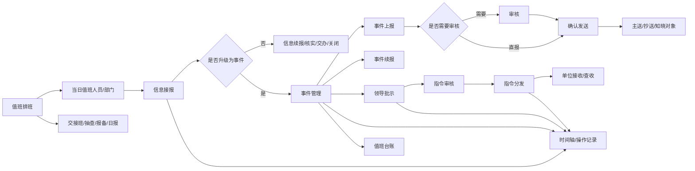
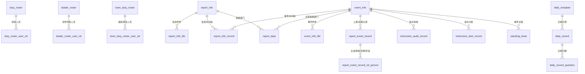

# 查找前后端代码

> 你能看到当前文件夹下面的前后端代码吗

2 previous messages

> 我先扫一眼当前工作区的目录结构，确认前后端代码都在哪些位置。
>
> 

Ran a command

>
> - Ran `Get-ChildItem -Force | Select-Object Mode,Name`
>
> 

能看到，当前目录下有两个项目：

- `E:\mayu_work\shuchuang2026\chengdu_codes\dyh-lbzbzllzxt-api`
- `E:\mayu_work\shuchuang2026\chengdu_codes\dyh-lbzbzllzxt-front`

看起来分别是后端和前端代码。

如果你愿意，我可以继续帮你：
1. 识别这两个项目分别用了什么技术栈
2. 帮你启动前后端
3. 看具体某个功能/接口/页面代码
4. 排查报错或直接改代码

> 你能帮我分析下这个项目吗？我知道它是一个值班值守的项目，了解个大概，你能帮我梳理下主要的业务流程吗？和主要的业务表，以及之间的关联关系

25 previous messages

> 我先从后端摸业务骨架，找数据库表、实体、接口模块；再对着前端菜单和页面把流程串起来。这样梳理出来会比较像“系统怎么运转”，不是只看文件名猜。
>
> 

Ran 2 commands

>
> - Ran `Get-ChildItem -Force`
> - Ran `Get-ChildItem -Force`
>
> 

>
> 已经看到是个 `jeecg-boot` 风格的后端和 Vue 前端。我接着会优先翻 `db`、后端业务模块、前端路由/菜单，这三块最能还原“值班值守”到底怎么跑。
>
> 

Ran 3 commands

>
> - Ran `rg --files db doc`
> - Ran `rg -n "@RequestMapping|@GetMapping|@PostMapping|@TableName|class .*Controller|class .*Entity" jeecg-boot-module-* -g "*.java"`
> - Ran `rg --files src`
>
> 

>
> `rg` 在这台环境里起不来，我换成 PowerShell 自带的遍历和全文检索继续扒，不影响分析，只是稍慢一点。
>
> 

Ran 3 commands

>
> - Ran `Get-ChildItem -Recurse -File db,doc | Select-Object FullName`
> - Ran `Get-ChildItem -Recurse -File src | Select-Object FullName`
> - Ran `Get-ChildItem -Recurse -Filter *.java jeecg-boot-module-* | Select-String -Pattern '@RequestMapping|@GetMapping|@PostMapping|@TableName|class .*Controller|class .*Entity' | Select-Object Path,LineNumber,Line`
>
> 

>
> 现在已经能看出来，真正的业务核心主要落在后端 `jeecg-boot-module-operation`，前端也有对应的 `duty / event / information / manage` 这些 API。接下来我会缩到这些业务包里，抽实体和控制器，顺手把 API 文档里的术语对齐一下。
>
> 

Ran 3 commands

>
> - Ran `Get-ChildItem -Recurse -Directory src\main\java\org\jeecg -Depth 4 | Where-Object { $_.FullName -match 'operation.*(duty|api|event|information|manage)' } | Select-Object FullName`
> - Ran `Get-Content -TotalCount 220 "doc\城运中心值班值守系统API文档.md"`
> - Ran `Get-Content -TotalCount 220 "src\api\event.js"`
>
> 

>
> 我开始下钻业务包了，重点会抓三类东西：`Entity` 对应表、`Controller` 对应流程节点、`Mapper.xml` 对应真实联表。这样最后能把“业务流程”和“表关系”放到一张图里。
>
> 

Ran 4 commands

>
> - Ran `Get-ChildItem -Recurse -File src\main\java\org\jeecg\event -Include *.java | Select-Object FullName`
> - Ran `Get-ChildItem -Recurse -File src\main\java\org\jeecg\api -Include *.java | Select-Object FullName`
> - Ran `Get-ChildItem -Recurse -File src\main\resources -Include *Mapper.xml | Select-Object FullName`
> - Ran `Get-ChildItem -Recurse -File src\main\java\org\jeecg\duty -Include *.java | Select-Object FullName`
>
> 

>
> 我把范围再收紧一点，先列出业务类名。名字通常已经很诚实了，能很快圈出“值班排班、信息报送、事件流转、领导批示、短信通知”这些主线。
>
> 

Ran 4 commands

>
> - Ran `Get-ChildItem -Recurse -File src\main\java\org\jeecg\duty -Include *.java | Select-Object Name,DirectoryName`
> - Ran `Get-ChildItem -Recurse -File src\main\java\org\jeecg\event -Include *.java | Select-Object Name,DirectoryName`
> - Ran `Get-ChildItem -Recurse -File src\main\java\org\jeecg\api -Include *.java | Select-Object Name,DirectoryName`
> - Ran `Get-ChildItem -Recurse -File src\main\resources\mapper -Include *Mapper.xml | Select-Object Name`
>
> 

>
> 我现在已经把“值班侧”的类名梳出来了，下一步去抓“事件/信息报送侧”的入口。这个项目明显不是单一排班系统，而是“值守 + 信息报送 + 事件处置 + 指令分发”四块绑在一起。
>
> 

Ran 4 commands

>
> - Ran `Get-ChildItem -Recurse -File src\main\java -Include *EventInfo*Controller.java,*ReportInfo*Controller.java,*Process*Controller.java,*Instruction*Controller.java,*Audit*Controller.java,*Inform*Controller.java,*Emergency*Controller.java | Select-Object Name,FullName`
> - Ran `Get-Content -TotalCount 260 "src\api\infomation.js"`
> - Ran `Get-Content -TotalCount 260 "src\api\duty.js"`
> - Ran `Get-Content -TotalCount 260 "src\api\manage.js"`
>
> 

>
> 我在读几个核心控制器和实体文件，准备把“信息上报怎么变成事件、事件怎么审核和分发、值班排班怎么支撑这套流程”串成一条完整链路。稍后会给你一个能直接拿去讲给别人听的版本。
>
> 

Ran 4 commands

>
> - Ran `$i=1; Get-Content 'src\main\java\org\jeecg\report\ReportInfoController.java' | ForEach-Object {('{0,4}: {1}' -f $i, $_); $i++} | Select-Object -First 260`
> - Ran `$i=1; Get-Content 'src\main\java\org\jeecg\event\ProcessController.java' | ForEach-Object {('{0,4}: {1}' -f $i, $_); $i++} | Select-Object -First 320`
> - Ran `$i=1; Get-Content 'src\main\java\org\jeecg\event\InstructionDistrRecordController.java' | ForEach-Object {('{0,4}: {1}' -f $i, $_); $i++} | Select-Object -First 260`
> - Ran `$i=1; Get-Content 'src\main\java\org\jeecg\event\EventInfoController.java' | ForEach-Object {('{0,4}: {1}' -f $i, $_); $i++} | Select-Object -First 320`
>
> 

>
> 路径层级比我刚才预估的深一点，我先把这些控制器的真实位置拎出来再读。 small detour，不影响结论。
>
> 

Ran 12 commands

>
> - Ran `Get-ChildItem -Recurse -File src\main\java -Filter ReportInfoController.java | Select-Object FullName`
> - Ran `Get-ChildItem -Recurse -File src\main\java -Filter EventInfoController.java | Select-Object FullName`
> - Ran `Get-ChildItem -Recurse -File src\main\java -Filter ProcessController.java | Select-Object FullName`
> - Ran `Get-ChildItem -Recurse -File src\main\java -Filter InstructionDistrRecordController.java | Select-Object FullName`
> - Ran `Get-ChildItem -Recurse -File src\main\java -Filter ReportInfoController.java | ForEach-Object { $_.FullName }`
> - Ran `Get-ChildItem -Recurse -File src\main\java -Filter InstructionDistrRecordController.java | ForEach-Object { $_.FullName }`
> - Ran `Get-ChildItem -Recurse -File src\main\java -Filter EventInfoController.java | ForEach-Object { $_.FullName }`
> - Ran `Get-ChildItem -Recurse -File src\main\java -Filter ProcessController.java | ForEach-Object { $_.FullName }`
> - Ran `$i=1; Get-Content 'src\main\java\org\jeecg\operation\controller\ReportInfoController.java' | ForEach-Object {('{0,4}: {1}' -f $i, $_); $i++} | Select-Object -First 280`
> - Ran `$i=1; Get-Content 'src\main\java\org\jeecg\operation\controller\EventInfoController.java' | ForEach-Object {('{0,4}: {1}' -f $i, $_); $i++} | Select-Object -First 340`
> - Ran `$i=1; Get-Content 'src\main\java\org\jeecg\operation\controller\InstructionDistrRecordController.java' | ForEach-Object {('{0,4}: {1}' -f $i, $_); $i++} | Select-Object -First 260`
> - Ran `$i=1; Get-Content 'src\main\java\org\jeecg\activiti\controller\ProcessController.java' | ForEach-Object {('{0,4}: {1}' -f $i, $_); $i++} | Select-Object -First 340`
>
> 

>
> 我开始把关键实体的“表名 + 主字段”摘出来了。这个阶段有点像看施工图纸，但收获很大，因为能直接看到业务数据到底落在哪些表上。
>
> 

Ran 2 commands

>
> - Ran ``$files = 'ReportInfo.java','ReportDept.java','ReportInfoFile.java','ReportInfoRecord.java','EventInfo.java','EventInfoFile.java','ReportEventRecord.java','ReportEventRecordRelPerson.java','InstructionAuditRecord.java','InstructionDistrRecord.java','InstructionReport.java','InformRecord.java'; foreach($f in $files){ Get-ChildItem -Recurse -File src\main\java -Filter $f | ForEach-Object { "### $($_.Name)`n"; Get-Content $_.FullName | Select-Object -First 140; "`n" } }``
> - Ran ``$files = 'DutyRoster.java','DutyRosterUserRel.java','ShiftRecord.java','StandingBook.java','DailyRecord.java','DailyRecordQuestion.java','DailyConfig.java','DailyTemplate.java','FilingRecord.java','LeaderRoster.java','LeaderRosterUserRel.java','TownDutyRoster.java','TownDutyRosterUserRel.java','SpotCheckRecord.java','InstructionAccount.java','AddressBook.java'; foreach($f in $files){ Get-ChildItem -Recurse -File src\main\java -Filter $f | ForEach-Object { "### $($_.Name)`n"; Get-Content $_.FullName | Select-Object -First 140; "`n" } }``
>
> 

>
> 我去前端再对一遍页面入口和菜单命名，避免只从后端表结构反推业务。这样能把“用户实际怎么点”的路径也补全。
>
> 

Ran 3 commands

>
> - Ran `Get-ChildItem -Recurse -File src -Include *router*.js,*routes*.js,permission.js,project.conf.js | Select-Object FullName`
> - Ran `Get-ChildItem -Recurse -Directory src\views | Select-Object FullName`
> - Ran `Get-ChildItem -Recurse -File src\views -Include *.vue | Where-Object { $_.FullName -match 'duty|event|info|report|instruction|daily|spot|filing|shift|standing|emergency' } | Select-Object Name,DirectoryName`
>
> 

>
> 前端也基本坐实了：页面模块跟后端表/接口一一能对上。接下来我会把它整理成三部分给你：业务主线、核心业务表、表间关联图。
>
> 

Ran 4 commands

>
> - Ran `$i=1; Get-Content 'src\api\infomation.js' | ForEach-Object {('{0,4}: {1}' -f $i, $_); $i++} | Select-Object -First 240`
> - Ran `$i=1; Get-Content 'src\api\event.js' | ForEach-Object {('{0,4}: {1}' -f $i, $_); $i++} | Select-Object -First 220`
> - Ran `$i=1; Get-Content 'src\api\duty.js' | ForEach-Object {('{0,4}: {1}' -f $i, $_); $i++} | Select-Object -First 220`
> - Ran `$i=1; Get-Content 'src\main\java\org\jeecg\duty\controller\DutyRosterController.java' | ForEach-Object {('{0,4}: {1}' -f $i, $_); $i++} | Select-Object -First 260`
>
> 

>
> 

Plan

>
> - [x] 查看前后端目录结构，定位业务模块、数据库脚本和核心配置
> - [x] 梳理后端实体/Mapper/Controller，提取主要业务表和关联关系
> - [x] 结合前端路由与页面，整理主要业务流程并输出概览
>
> 

可以，我先给你一个“适合快速建立全局认知”的版本。这个项目不是单纯的排班系统，而是一个以“值班值守”为底座，叠加了“信息接报、事件处置、指令分发、台账留痕、日报报送”的综合业务系统。

从代码看，后端核心主要在 `jeecg-boot-module-operation`，前端主要落在 `src/views/modules/duty`、`src/views/modules/info`、`src/views/modules/event`、`src/views/modules/cyDaily` 这几块。对应接口也很清楚：值班是 `/duty/*`，信息报送是 `/report/reportInfo/*`，事件处置是 `/report/eventInfo/*` 和 `/report/process/*`，指令是 `/report/instruction*/*`。

**一、这个系统的主要业务主线**

**1. 值班排班主线**
先有“谁在值班”。

业务动作大概是：
1. 管理员维护值班排班
2. 给某一天、某部门安排值班人员
3. 维护领导带班、普通值班、区县/镇街值班
4. 值班期间做交接班、抽查、报备、通讯录维护
5. 所有事件和信息流转，默认都依赖当前值班体系去找人、找部门、找责任链

这条线的核心接口能对上：
- 前端 `src/api/duty.js`
- 后端 `DutyRosterController`：`/duty/dutyRoster/list`、`/add`、`/queryById`、`/queryByOrgCode`
  见 [DutyRosterController.java](./dyh-lbzbzllzxt-api/jeecg-boot-module-operation/src/main/java/org/jeecg/duty/controller/DutyRosterController.java:91)

**2. 信息接报主线**
这是“收到一条情况/信息”的入口，很多事件都是从这里长出来的。

典型流程：
1. 值班人员新建一条信息接报
2. 填写级别、类型、地点、时间、描述、伤亡、附件等
3. 系统把信息分发给相关部门接报/跟踪
4. 可以做信息核实、补充续报、交办跟踪
5. 某些信息可以进一步“转成事件”

对应代码很明显：
- 前端 `reportInfoList`、`reportInfo`、`addInfo`、`delivery`、`reportLine`
  见 [infomation.js](./dyh-lbzbzllzxt-front/src/api/infomation.js:38)
- 后端 `ReportInfoController`
  - `/report/reportInfo/list` 信息上报列表
  - `/report/reportInfo/add` 创建信息
  - `/report/reportInfo/detail` 详情
  - `/report/reportInfo/addInfo` 信息续报
  - `/report/reportInfo/delivery` 交办/跟踪
  - `/report/reportInfo/link` 关联事件
  见 [ReportInfoController.java](./dyh-lbzbzllzxt-api/jeecg-boot-module-operation/src/main/java/org/jeecg/operation/controller/ReportInfoController.java:98)

**3. 事件处置主线**
这是“正式事件管理”主线，比信息接报更重。

典型流程：
1. 直接创建事件，或者由信息接报转成事件
2. 事件进入上报流程
3. 选择主送、抄送、审核对象
4. 审核通过后确认发送
5. 事件处理中可以续报
6. 可以加领导批示、报省、市委市政府值班室
7. 最终进入台账、留痕、归档

对应代码：
- 前端
  - `createEvent` 创建事件
  - `eventAudit` 事件审核
  - `confirmSend` 确认发送
  - `reportLineEvent` 事件时间轴
  见 [infomation.js](./dyh-lbzbzllzxt-front/src/api/infomation.js:239)、[event.js](./dyh-lbzbzllzxt-front/src/api/event.js:31)
- 后端
  - `EventInfoController`：事件创建、列表、审核列表、领导批示、分类、详情
    见 [EventInfoController.java](./dyh-lbzbzllzxt-api/jeecg-boot-module-operation/src/main/java/org/jeecg/operation/controller/EventInfoController.java:286)
  - `ProcessController`：上报、审核、确认发送、续报、短信预览
    见 [ProcessController.java](./dyh-lbzbzllzxt-api/jeecg-boot-module-operation/src/main/java/org/jeecg/activiti/controller/ProcessController.java:73)

**4. 指令/批示主线**
这是事件处理往上走的一层。

典型流程：
1. 事件发生后，领导批示进入系统
2. 批示可绑定到事件
3. 批示需要审核
4. 审核后形成“指令分发”
5. 下发到相关单位，并跟踪签收/接收

对应：
- `InstructionAuditRecord` 指令审核记录
- `InstructionDistrRecord` 指令分发记录
- `InstructionReport` 批示摘清/文稿
- `InstructionAccount` 指示台账

接口在：
- `InstructionDistrRecordController` `/report/instructionDistrRecord/add`
- 前端 `confirmSendStruct`、`instrucAudit`
  见 [InstructionDistrRecordController.java](./dyh-lbzbzllzxt-api/jeecg-boot-module-operation/src/main/java/org/jeecg/operation/controller/InstructionDistrRecordController.java:68)

**5. 日报/专项报送主线**
这块是“制度化日常报送”。

流程大概是：
1. 配置日报模板和发送时间
2. 各单位按模板填报日报
3. 提交、查收、驳回、补填
4. 记录问题项和同步状态

前端对应 `cyDaily` 模块，后端表有：
- `daily_task`
- `daily_template`
- `daily_record`
- `daily_record_question`

**二、主要业务表梳理**

我按业务域给你归类。

**1. 值班排班域**
最核心：

- `duty_roster`
  一天一个部门的值班排班主表。字段很少，核心是 `duty_date`、`duty_org_code`、`status`
  见 [DutyRoster.java](./dyh-lbzbzllzxt-api/jeecg-boot-module-operation/src/main/java/org/jeecg/duty/entity/DutyRoster.java:1)

- `duty_roster_user_rel`
  排班人员明细表。一个排班下挂多个人，存人员、岗位、电话、值班等级、人员类型
  见 [DutyRosterUserRel.java](./dyh-lbzbzllzxt-api/jeecg-boot-module-operation/src/main/java/org/jeecg/duty/entity/DutyRosterUserRel.java:1)

- `leader_roster` / `leader_roster_user_rel`
  领导带班排班主表和人员表

- `town_duty_roster` / `town_duty_roster_user_rel`
  镇街值班排班主表和人员表

配套表：
- `shift_record` 交接班记录
- `spot_check_record` 值班抽查记录
- `filing_record` 外出报备/报备记录
- `address_book` 通讯录
- `instruction_account` 指示台账
- `standing_book` 值班台账

**2. 信息接报域**
核心表：

- `report_info`
  信息主表。存级别、类型、描述、地点、时间、报送渠道、报送单位、伤亡、状态
  状态字段说明非常关键，已经能看出它贯穿“待上报/待审核/处理中/结束”等状态
  见 [ReportInfo.java](./dyh-lbzbzllzxt-api/jeecg-boot-module-operation/src/main/java/org/jeecg/operation/entity/ReportInfo.java:1)

- `report_dept`
  信息和部门的关联表。它既能挂 `report_info_id`，也能挂 `event_info_id`，说明它承担了“某条信息/事件发给哪些部门”的关系
  见 [ReportDept.java](./dyh-lbzbzllzxt-api/jeecg-boot-module-operation/src/main/java/org/jeecg/operation/entity/ReportDept.java:1)

- `report_info_file`
  信息附件表

- `report_info_record`
  这是非常关键的“全流程操作记录/时间轴表”。
  它的 `record_type` 枚举直接暴露了业务动作：
  - 信息创建
  - 创建事件
  - 信息续报
  - 领导批示
  - 结束事件
  - 指令分发
  - 交办跟踪
  - 上报/续报
  - 审核
  - 信息核实
  - 关闭
  - 已读
  - 报省委/报省政府
  等等
  见 [ReportInfoRecord.java](./dyh-lbzbzllzxt-api/jeecg-boot-module-operation/src/main/java/org/jeecg/operation/entity/ReportInfoRecord.java:1)

这张表我建议你把它理解为“系统业务时间轴总账”。

**3. 事件处置域**
核心表：

- `event_info`
  事件主表。跟 `report_info` 很像，但更偏正式事件
  见 [EventInfo.java](./dyh-lbzbzllzxt-api/jeecg-boot-module-operation/src/main/java/org/jeecg/operation/entity/EventInfo.java:1)

- `event_info_file`
  事件附件表

- `report_event_record`
  事件上报/续报流程记录表，偏流程实例级别，字段有：
  - `event_info_id`
  - `record_type` 首报审核/续报审核
  - `record_content`
  - `report_type` 直报 or 需审核
  - `proc_inst_id` 流程实例ID
  见 [ReportEventRecord.java](./dyh-lbzbzllzxt-api/jeecg-boot-module-operation/src/main/java/org/jeecg/operation/entity/ReportEventRecord.java:1)

- `report_event_record_rel_person`
  事件流程参与人员关系表，特别重要。
  `person_type` 表示：
  - `0` 主送对象
  - `1` 审核人员
  - `2` 知晓人员
  - `3` 抄送对象
  见 [ReportEventRecordRelPerson.java](./dyh-lbzbzllzxt-api/jeecg-boot-module-operation/src/main/java/org/jeecg/operation/entity/ReportEventRecordRelPerson.java:1)

这两张表组合起来，基本就是“事件流程路由”。

**4. 指令批示域**
核心表：

- `instruction_audit_record`
  指令审核表，挂事件、内容、流程实例、审核状态
  见 [InstructionAuditRecord.java](./dyh-lbzbzllzxt-api/jeecg-boot-module-operation/src/main/java/org/jeecg/operation/entity/InstructionAuditRecord.java:1)

- `instruction_distr_record`
  指令分发表，挂事件、内容、接收单位、接收状态、批示领导
  见 [InstructionDistrRecord.java](./dyh-lbzbzllzxt-api/jeecg-boot-module-operation/src/main/java/org/jeecg/operation/entity/InstructionDistrRecord.java:1)

- `instruction_report`
  批示摘清/报文模板结果

- `instruction_account`
  指示台账，偏归档/追踪

**5. 日报域**
核心表：

- `daily_task` 对应实体 `DailyConfig`，日报定时配置
- `daily_template` 日报模板
- `daily_record` 日报记录
- `daily_record_question` 日报问题明细

**三、这些表之间的主要关联关系**

你可以先记这几条主关系。

**1. 值班排班**
- `duty_roster` 1 - n `duty_roster_user_rel`
- `leader_roster` 1 - n `leader_roster_user_rel`
- `town_duty_roster` 1 - n `town_duty_roster_user_rel`

意思就是：一个排班主记录，对应多个人员明细。

**2. 信息接报**
- `report_info` 1 - n `report_info_file`
- `report_info` 1 - n `report_info_record`
- `report_info` 1 - n `report_dept`

意思就是：
- 一条信息可以有多个附件
- 一条信息在生命周期里会产生很多记录
- 一条信息可以发给多个部门

**3. 信息与事件**
- `report_dept` 同时有 `report_info_id` 和 `event_info_id`
- `report_info_record.record_type = 创建事件 / 关联事件` 这类记录说明信息会转事件
- `report_info_record` 里直接也有 `event_info_id`

这说明：
**信息接报不是事件的子表，而是事件的前置来源之一**。两者是“可转换、可关联”的关系，不是严格一对一。

**4. 事件处置**
- `event_info` 1 - n `event_info_file`
- `event_info` 1 - n `report_event_record`
- `report_event_record` 1 - n `report_event_record_rel_person`

意思就是：
- 一个事件可以经历多轮“首报/续报/审核流程”
- 每一轮流程又会有多个参与对象：主送、审核、知晓、抄送

**5. 事件与指令**
- `event_info` 1 - n `instruction_audit_record`
- `event_info` 1 - n `instruction_distr_record`
- `event_info` 1 - n `instruction_account` 或间接归档

意思是：一个事件可能触发多次批示、多次指令下发。

**6. 事件/信息与总时间轴**
- `report_info_record` 其实横跨信息和事件两边
- 它既有 `report_info_id`，也有 `event_info_id`

所以这张表可以理解成：
**“这个系统最核心的业务留痕表之一”**。

**四、我建议你怎么理解这个项目**

如果只用一句话总结：

**这个系统是“以值班排班为组织底座，以信息接报为入口，以事件处置为主线，以批示指令和台账留痕为闭环”的值班值守平台。**

更直白一点：

- `值班` 解决“今天谁负责”
- `信息接报` 解决“收到了什么情况”
- `事件管理` 解决“哪些情况升级成正式事件”
- `流程审核/上报/续报` 解决“事件怎么流转”
- `批示/指令分发` 解决“领导要求怎么下达到责任单位”
- `台账/日报/抽查/交接班` 解决“值守工作怎么制度化、可追踪、可考核”

**五、如果你后面要继续深入，我建议下一步这样做**

我可以继续帮你做两种更细的梳理：

1. 给你画一版“业务流程图 + 表关系图”
2. 按模块输出一份“表清单说明文档”，包括每张表的用途、关键字段、上下游关系

如果你愿意，我下一条可以直接给你出一版：
**“值班值守项目业务架构图（文字版）+ 核心ER关系图（文字版）”**。这样你后面跟老师、同事、甲方讲都会很顺。

> 好的，你继续

好的，我继续把它整理成“能讲清楚系统”的版本。

**业务架构图**

可以这样理解：
**值班排班是组织基础，信息接报是入口，事件管理是主流程，批示指令是处置延伸，时间轴和台账负责留痕闭环。**

**核心流程**
1. **排班准备**
   维护 `duty_roster`、`duty_roster_user_rel`，确定每天每个单位谁值班、谁带班、联系方式是什么。

2. **信息接报**
   值班人员创建 `report_info`，上传附件到 `report_info_file`，系统按部门生成 `report_dept`，并写入 `report_info_record`。

3. **信息处理**
   信息可以被查收、续报、核实、交办跟踪、关闭。每个动作都会继续写 `report_info_record`。

4. **转为事件**
   某条信息如果重要，会创建或关联 `event_info`。这时信息和事件之间通过 `report_dept.event_info_id`、`report_info_record.event_info_id` 等字段建立联系。

5. **事件上报/审核**
   事件产生 `report_event_record`，如果需要审核，会走 `ProcessController` 的 `/report/process/report`、`/audit`、`/confirmSend`。主送、审核、知晓、抄送人员落在 `report_event_record_rel_person`。

6. **领导批示和指令分发**
   事件可新增领导批示，进入 `instruction_audit_record` 审核，通过后生成 `instruction_distr_record`，下发给相关单位。

7. **闭环留痕**
   事件结束后进入 `standing_book` 台账；交接班写 `shift_record`；抽查写 `spot_check_record`；日报写 `daily_record` 系列表。

**核心ER关系**

**最重要的表**
| 表                               | 作用                                    |
| -------------------------------- | --------------------------------------- |
| `duty_roster`                    | 值班排班主表                            |
| `duty_roster_user_rel`           | 排班人员明细                            |
| `report_info`                    | 信息接报主表                            |
| `report_dept`                    | 信息/事件与接收部门关系                 |
| `report_info_record`             | 信息、事件、批示、指令的时间轴/操作日志 |
| `event_info`                     | 正式事件主表                            |
| `report_event_record`            | 事件首报/续报/审核流程记录              |
| `report_event_record_rel_person` | 事件流程参与人，主送、审核、知晓、抄送  |
| `instruction_audit_record`       | 指令审核记录                            |
| `instruction_distr_record`       | 指令分发记录                            |
| `standing_book`                  | 值班事件台账                            |
| `shift_record`                   | 交接班记录                              |
| `spot_check_record`              | 值班抽查记录                            |
| `daily_record`                   | 日报记录                                |

**一句话版本**
这个项目的主线是：

> 值班人员按照排班值守，接收各类突发/日常信息；重要信息升级为事件，事件经过上报、审核、确认发送、续报、领导批示、指令分发，最终形成时间轴、台账、日报和考核留痕。

我建议下一步继续把它拆成一份“模块说明文档”：每个模块对应哪些前端页面、哪些接口、哪些表、主要状态怎么流转。
